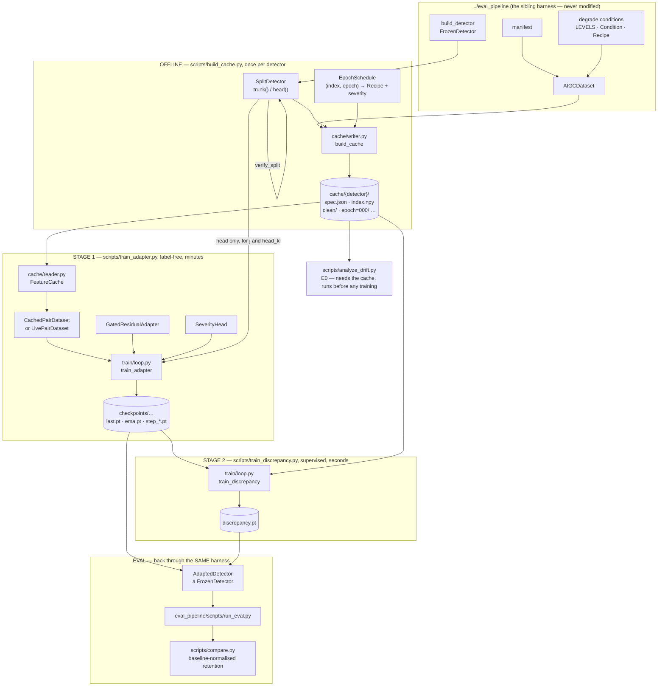

# The GRACE pipeline, component by component

A reference walkthrough of `grace_adapter/`. Part I is the map: every component,
what it is, and what it does. Part II zooms in on each one with the code that
implements it.

This document describes the code as it stands. Where a module is a blueprint or
depends on a repo that is not vendored in this tree, it says so.

---

## Table of contents

**Part I — the map**
1. [What the pipeline does](#1-what-the-pipeline-does)
2. [Data flow](#2-data-flow)
3. [Component index](#3-component-index)
4. [Execution order](#4-execution-order)

**Part II — the components**
5. [`grace/config.py` — configuration](#5-graceconfigpy--configuration)
6. [`grace/splits/` — the trunk/head seam](#6-gracesplits--the-trunkhead-seam)
7. [`grace/cache/` — the feature cache](#7-gracecache--the-feature-cache)
8. [`grace/models/` — the adapter and the heads](#8-gracemodels--the-adapter-and-the-heads)
9. [`grace/train/` — objective, diagnostics, loops](#9-gracetrain--objective-diagnostics-loops)
10. [`grace/detectors/adapted.py` — re-entry into the harness](#10-gracedetectorsadaptedpy--re-entry-into-the-harness)
11. [`scripts/` — the entry points](#11-scripts--the-entry-points)
12. [`configs/` — the config kinds](#12-configs--the-config-kinds)
13. [`tests/` — what is pinned](#13-tests--what-is-pinned)

**Appendices**
- [A. Invariants and where they are enforced](#appendix-a-invariants-and-where-they-are-enforced)
- [B. Dependencies on the sibling harness](#appendix-b-dependencies-on-the-sibling-harness)
- [C. Known gaps](#appendix-c-known-gaps)

---

# Part I — the map

## 1. What the pipeline does

GRACE trains a ~2M-parameter residual adapter that maps a **frozen** detector's
features of a *degraded* image back onto its features of the *clean* image. The
detector is never fine-tuned. The adapter is spliced at the detector's trunk/head
seam:

```
GRACE     logit = head( adapter(trunk(x)) )                        label-free
GRACE-D   logit = head( adapter(trunk(x)) ) + β · aux(Δ, severity)  + labels
                                              Δ = adapter(f_deg) − f_deg
```

Three properties drive nearly every design decision in the package:

| Property | Consequence in the code |
|---|---|
| The trunk is frozen and the clean image never changes | Clean features are **constant** → compute once to disk (`grace/cache/`) |
| Degradation recipes are a pure function of `(image, condition)` | Degraded features are **also** precomputable → `epoch ≡ replicate` (`grace/cache/schedule.py`) |
| The adapter must be attributable | Identity at init, exactly (`grace/models/adapter.py`), and β=0 at init (`FusedHead`) |

In `source: cache` mode the training loop contains **no trunk forward at all** — a
step is two memmap reads and a 2-layer MLP.

## 2. Data flow



## 3. Component index

Every path is relative to `grace_adapter/`.

### Configuration

| File | What it is |
|---|---|
| `grace/config.py` | Ten dataclasses + four loaders. Unknown YAML keys **raise**. |
| `configs/defaults.yaml` | Annotated reference of every key. Never loaded by code. |

`ProbeConfig` (stage 0) and `WandbConfig` (tracking) are the two newest, and both
are additions rather than changes: every existing config still loads unchanged,
because `wandb` defaults to disabled and `configs/probe/` is read by one script
nothing else calls.

### The seam — `grace/splits/`

| File | What it is |
|---|---|
| `base.py` | `FeatureSpec` (layout/shape/dtype) and `SplitDetector` (`trunk`/`head`/`assert_frozen`/`taps`). |
| `verify.py` | `verify_split` — asserts `head(trunk(x)) == detector(x)` at construction. |
| `rine.py` | `RINESplit` — CLIP ViT-L/14 CLS tokens from 24 blocks → `layers` (24, 1024). |
| `bfree.py` | `BFreeSplit` — five window embeddings → `tokens` (5, D). Trunk pending clone. |
| `gapl.py` | `GAPLSplit` — pooled embedding → `vector` (D,). Trunk pending clone. |
| `dinov3.py` | `DINOv3Split` — **the PoC seam**. Delegates to `DINOv3MLPDetector.trunk`/`.head` rather than reconstructing a vendored repo's composition, so `head(trunk(x)) == detector(x)` holds by construction. `vector` (768,). The only split that runs today. |
| `__init__.py` | `build_split(detector, "dotted.path.Class")`. No registry. |

The first three reconstruct a seam inside a repo cloned by hand under
`third_party/`; `dinov3.py` does not, which is the entire reason it exists. See
`grace_adapter/README.md` §7.

### Stage 0 — `grace/probe/`

| File | What it is |
|---|---|
| `train.py` | `extract_features` (one trunk forward per image, ever) + `train_probe` — fits the PoC detector's MLP head on **clean** features, selecting on held-out images by AUC. |

The one place in the project a detector is trained, and it exists only because a
DINOv3 trunk has no classifier. Clean images, no augmentation: a head fit under
degradation would have partly solved the problem GRACE exists to solve.

### The cache — `grace/cache/`

| File | What it is |
|---|---|
| `schedule.py` | `EpochSchedule`: `(index, epoch) → Condition/Recipe/severity`, pure. `VAL_EPOCH_OFFSET = 10_000`. |
| `spec.py` | `CacheSpec` + four fingerprints (`manifest`, `schedule`, `detector`, `preprocess`). |
| `writer.py` | `ShardWriter`, `build_view`, `build_cache` — offline render, resumable per view. |
| `reader.py` | `FeatureCache` — memmap random access by *manifest index*, opened per worker. |

### The models — `grace/models/`

| File | What it is |
|---|---|
| `adapter.py` | `GatedResidualAdapter` — `y = f + g ⊙ MLP(LN(f))`, + optional noise `z` and severity FiLM. |
| `severity.py` | `SeverityHead` — degraded features → severity ∈ [0,1]. Target comes from the sampler. |
| `discrepancy.py` | `DiscrepancyHead` (reads Δ) and `FusedHead` (`logit + β·aux`, β=0 at init). |
| `factory.py` | The **only** layout branch (`gate_shape_for`), plus `save_adapter` / `load_adapter`. |
| `ladder.py` | FUTURE — multi-seam adapter. Blueprint, raises `NotImplementedError`. |
| `prompts.py` | FUTURE — degradation prompts. Blueprint, raises `NotImplementedError`. |

### Training — `grace/train/`

| File | What it is |
|---|---|
| `weighting.py` | `head_gradient` (∇_f h) and `decision_weighted_error` (Jacobian-weighted MSE). |
| `losses.py` | `alignment_loss`, `sliced_wasserstein`, `identity_loss`, `head_kl`, `severity_loss`, `supervised_bce`, `total_loss`. |
| `diagnostics.py` | `decision_alignment`, `drift`, `drift_asymmetry`, `posterior_spread`, `bootstrap_gap`. |
| `data.py` | `CachedPairDataset` / `LivePairDataset` + `build_loader` — one config flag apart. |
| `ema.py` | `EMA` — shadow weights, second checkpoint for free. |
| `tracker.py` | `NullTracker` / `WandbTracker` / `build_tracker` + the shared `--wandb*` CLI flags. Off by default; a null object rather than a conditional, so no code path in `loop.py` only runs on somebody's machine. |
| `loop.py` | `train_adapter` (stage 1), `validate`, `train_discrepancy` (stage 2), `_score_discrepancy`. |

`summary.json` next to the checkpoints remains the record of every run whether or
not anything was tracked, and a W&B failure mid-run warns once and continues
untracked rather than raising into the training loop.

### Re-entry — `grace/detectors/`

| File | What it is |
|---|---|
| `adapted.py` | `AdaptedDetector` — a `FrozenDetector`. Three configurations: identity / GRACE / GRACE-D. |

### Scripts

| Script | What it does |
|---|---|
| `train_probe.py` | **Stage 0, PoC only.** Fits the detector's own MLP head on clean features. Writes to the path the *detector* config names. |
| `analyze_drift.py` | **E0.** Reads a *rendered* cache and nothing else — run it after `build_cache.py`, before any training. Does fake drift more than real, and is that drift inside the head's sensitive subspace? |
| `build_cache.py` | Renders the cache. `--dry-run` prints the spec and GB first. |
| `train_adapter.py` | Stage 1. CLI overrides for sweeps. |
| `train_discrepancy.py` | Stage 2. `--adapter` override is what makes E4 a shell loop. |
| `compare.py` | Post-hoc, read-only. Retention against the **baseline's** clean AUC. |
| `poc.sh` | The whole PoC path in one command; `--smoke` for a minutes-long wiring check. |

## 4. Execution order

The PoC path (`grace_adapter/README.md` §7) is the one that runs end to end today
— the zoo splits still wait on their clones:

```bash
# 0. Datasets — four manifests. ntire_train (all six shards) is the fit set;
#    ntire_val + ntire_val_hard are stage-0 selection and stage-1 held-out
#    images; wildfake is the eval set, held out from all of them.
cd ../eval_pipeline
for d in ntire_train ntire_val ntire_val_hard wildfake_coco_dalle3; do
  python scripts/build_manifest.py --config configs/datasets/$d.yaml
done

# 1. Stage 0 — fit the detector's own head on CLEAN features.
cd ../grace_adapter && python scripts/train_probe.py configs/probe/dinov3_ntire.yaml

# 2-6. As below, with `dinov3` in place of `rine` — plus the two validation
#      caches (configs/cache/dinov3_val{,_hard}.yaml), which the stage-1 configs
#      name in `val_cache_dirs` and are not optional. Or all of it at once:
bash scripts/poc.sh
```

The general path, for a detector that arrives with its head already trained:

```bash
# 1. Render, once per detector. Resumable at view granularity.
python scripts/build_cache.py configs/cache/rine.yaml --dry-run
python scripts/build_cache.py configs/cache/rine.yaml

# 2. E0 — the premise, before anything is TRAINED on it. Reads the cache, no GPU.
python scripts/analyze_drift.py --cache cache/rine \
       --dataset ../eval_pipeline/configs/datasets/ntire_train.yaml

# 3. Stage 1 — minutes per run.
python scripts/train_adapter.py configs/train/rine_clean.yaml

# 4. Stage 2 — seconds per run.
python scripts/train_discrepancy.py configs/train/rine_discrepancy.yaml

# 5. Score through the SAME harness that produced the baseline.
cd ../eval_pipeline && python scripts/run_eval.py --config configs/runs/<run>.yaml
python scripts/compare.py --baseline <baseline.json> --adapted <adapted.json>
```

**E0 is second, not zeroth.** `analyze_drift.py` opens the cache in its first
statement and reads clean *and* degraded features out of it, exiting with
`no rendered epochs under <dir>` if no degraded view has been finalized. It comes
before anything is *trained*; the render is what it is built on.

The experiment arms these support:

| # | Arm | Config | Question |
|---|---|---|---|
| E0 | drift analysis | `scripts/analyze_drift.py` | does RA-Det's asymmetry hold here? |
| E1 | identity | `detectors/rine+identity.yaml` | does the split reproduce Day 1 *exactly*? |
| E2 | A vs B | `train/rine_degraded.yaml` / `rine_clean.yaml` | does the clean teacher buy retention? |
| E3 | loss ablations | `rine_plain_mse` / `rine_no_sw` / `rine_posterior` | Jacobian vs MSE; ±SW; ±noise |
| E4 | erasure trade-off | stage 2 vs every stage-1 checkpoint | does the adapter destroy evidence? |
| E5 | GRACE-D | `detectors/rine+grace-d.yaml` | does the fused score beat retention 1.0? |
| E6 | cached vs live | `train/rine_live.yaml` | is the finite epoch set being exploited? |

Each arm has a PoC twin — swap `rine` for `dinov3` in the config name. E2 and E3
are the load-bearing ones and need no particular detector, so they run there in
seconds; E4 and E5 run but test the discrepancy branch in its weakest form, since
a `vector` split gives the auxiliary head one drift norm rather than RINE's 24.

---

# Part II — the components

> **A note on the snippets.** Code blocks are quoted from the source. Function
> signatures are occasionally condensed onto fewer lines and long per-argument
> type annotations elided for readability; bodies and docstring content are
> verbatim. The file and symbol names are given for every one, so the source is
> the authority.

## 5. `grace/config.py` — configuration

**Role.** YAML ↔ dataclass, mirroring `pipeline.config` in the sibling harness.
Three kinds of config, one directory each:

```
configs/cache/<name>.yaml       what to render, for which detector
configs/train/<name>.yaml       one stage-1 or stage-2 run against a cache
configs/detectors/<name>.yaml   the ADAPTED detector, in the harness's shape
```

Detectors and datasets are **never redefined here** — a cache config references
`../eval_pipeline/configs/detectors/*.yaml` and `.../datasets/*.yaml` by path, so
each is described in exactly one place and GRACE cannot drift from what was
benchmarked.

### 5.1 The dataclasses

`ScheduleConfig` is the training degradation distribution — deliberately *not*
the eval sweep. Eval is a controlled one-factor-at-a-time grid; training samples
from the same operator pool under `level_weights`:

```python
@dataclass
class ScheduleConfig:
    grid_file: str = "../eval_pipeline/configs/degradations.yaml"
    transforms: list[str] | None = None
    level_weights: dict[int, float] = field(
        default_factory=lambda: dict(DEFAULT_LEVEL_WEIGHTS)
    )
    seed: int = 0
```

Sharing `grid_file` with the harness keeps both at the same eleven transforms at
the same parameter values. Setting `transforms:` to a subset makes "held-out
transforms" a deliberate experiment rather than an accident.

`CacheConfig` describes one render — the clean view plus `n_epochs` degraded ones:

```python
@dataclass
class CacheConfig:
    detector: str
    split: str
    dataset: str
    out_dir: str = "cache/"
    n_epochs: int = 12
    n_val_epochs: int = 2
    dtype: str = "float16"
    shard_size: int = 50_000
    batch_size: int = 32
    num_workers: int = 8
    max_images: int | None = None
    device: str = "auto"
    schedule: ScheduleConfig = field(default_factory=ScheduleConfig)
```

`AdapterConfig`, `SamplingConfig`, `LossConfig` and `DiscrepancyConfig` shape the
modules. Note the two comments that encode coupling between knobs:

```python
@dataclass
class AdapterConfig:
    bottleneck: int = 256
    n_blocks: int = 2
    per_channel_gate: bool = True
    dropout: float = 0.0
    noise_dim: int = 0
    """0 disables posterior sampling. Only worth turning on alongside `lam_sw`;
    see grace.models.adapter."""
    severity_film: bool = True


@dataclass
class LossConfig:
    weighting: str = "jacobian"     # "none" reproduces the GRACE v1 objective
    eps_iso: float = 0.05           # 1.0 is exactly plain MSE
    w_cos: float = 1.0
    w_err: float = 1.0
    lam_sw: float = 0.1
    n_proj: int = 64
    lam_id: float = 0.5
    lam_kl: float = 0.1             # demoted: subsumed by the Jacobian weighting
    kl_temperature: float = 2.0
    lam_sev: float = 0.1
```

`TrainConfig` is one stage-1 run. Two fields carry more meaning than their names
suggest:

```python
@dataclass
class TrainConfig:
    run_id: str
    cache_dir: str
    target_view: str = "clean"      # "clean" (arm B) | "degraded" (arm A control)
    source: str = "cache"           # "cache" | "live"
    ...
    checkpoint_every: int = 0
    """>0 writes intermediate stage-1 checkpoints. Experiment E4 trains the
    discrepancy head against each of them to see whether the adapter erases
    forensic evidence as it improves."""
    detector: str = ""
    """The harness detector config. Needed even in `source: cache` mode: the
    frozen head is what `head_kl` and the Jacobian weighting differentiate
    through, so the model is loaded whether or not the trunk ever runs."""
```

`target_view` **is** the E2 ablation: `"clean"` is arm B (the proposed method),
`"degraded"` is arm A (symmetric self-distillation, the control). `detector` being
required even in cache mode is the non-obvious one — no trunk runs, but the head
still has to be differentiated through.

`DiscrepancyTrainConfig` is stage 2, and is a separate dataclass on purpose:

```python
@dataclass
class DiscrepancyTrainConfig:
    """Stage 2. The adapter is frozen; only the aux head and β train.

    Separate from `TrainConfig` because the separation is the scientific claim:
    the label-free adapter is a finished artifact before this stage begins, and
    GRACE and GRACE-D ship the same weights.
    """

    run_id: str
    cache_dir: str
    adapter_checkpoint: str
    epochs: int = 4
    ...
    discrepancy: DiscrepancyConfig = field(default_factory=DiscrepancyConfig)
```

### 5.2 The loader — unknown keys raise

```python
def _build(cls, raw: dict):
    """Instantiate `cls` from `raw`, recursing into nested dataclass fields.

    Unknown keys raise rather than being ignored: a typo in a config that
    silently trains the default objective is a whole day lost.
    """
    known = {f.name: f for f in fields(cls)}
    unknown = set(raw) - set(known)
    if unknown:
        raise KeyError(f"{cls.__name__} got unknown key(s) {sorted(unknown)}")
    kwargs = {}
    for name, value in raw.items():
        f = known[name]
        if is_dataclass(f.type) and isinstance(value, dict):
            kwargs[name] = _build(f.type, value)
        else:
            kwargs[name] = value
    return cls(**kwargs)
```

Two behaviours follow. **Absent keys fall through to dataclass defaults** rather
than being restated in YAML, so there is one place a default is written down —
which is why `configs/train/rine_clean.yaml` is 15 lines and ends with
`loss: {}`. And **a typo is an immediate `KeyError`**, not a run that quietly
trains the default objective and looks like a negative result.

The three public loaders are thin:

```python
def load_cache_config(path)       -> CacheConfig:            return _build(CacheConfig, read_yaml(path))
def load_train_config(path)       -> TrainConfig:            return _build(TrainConfig, read_yaml(path))
def load_discrepancy_config(path) -> DiscrepancyTrainConfig: return _build(DiscrepancyTrainConfig, read_yaml(path))
```

`configs/defaults.yaml` documents every key of every kind with its default and is
never loaded — `tests/test_configs.py::test_defaults_yaml_is_documentation_only`
pins that.

---

## 6. `grace/splits/` — the trunk/head seam

**Role.** `FrozenDetector` in the harness is deliberately opaque — image in, logit
out — because measurement needs nothing else. GRACE needs the *seam*: a feature
tensor it can cache, correct, and feed back. `SplitDetector` is that seam, added
**around** a detector rather than inside it, so the harness stays model-agnostic
and the zoo adapters stay untouched.

The whole contract is one equation:

```
head(trunk(x)) == detector(x)      for every x, to float tolerance
```

### 6.1 `base.py` — `FeatureSpec`

Three layouts, distinguished by what the trunk emits per image:

```python
LAYOUTS = ("vector", "tokens", "layers")
"""What the trunk emits, per image, ignoring the batch dimension.

    vector  (D,)      one embedding                      -- GAPL
    tokens  (T, D)    per-patch or per-window tokens     -- B-Free (5 windows)
    layers  (L, D)    one CLS token per encoder block    -- RINE

`tokens` and `layers` are the same tensor rank and differ only in what the
adapter does with the group axis: tokens share one gate, layers get one gate
each. That is a `gate_shape` argument, not a class."""

_NDIM = {"vector": 1, "tokens": 2, "layers": 2}
```

`FeatureSpec` is a frozen dataclass that validates itself and exposes the three
derived quantities everything downstream indexes by:

```python
@dataclass(frozen=True)
class FeatureSpec:
    layout: str
    shape: tuple[int, ...]
    dtype: str = "float16"

    def __post_init__(self):
        if self.layout not in LAYOUTS:
            raise ValueError(f"layout must be one of {LAYOUTS}, got {self.layout!r}")
        if len(self.shape) != _NDIM[self.layout]:
            raise ValueError(
                f"layout {self.layout!r} expects a {_NDIM[self.layout]}-d shape, "
                f"got {self.shape}"
            )
        object.__setattr__(self, "shape", tuple(int(s) for s in self.shape))

    @property
    def dim(self) -> int:
        """Channel width -- the axis the adapter's MLP operates on."""
        return self.shape[-1]

    @property
    def n_groups(self) -> int:
        """Size of the group axis: layers for `layers`, tokens for `tokens`, 1 for
        `vector`."""
        return self.shape[0] if len(self.shape) == 2 else 1
```

`dtype` is the **cache** dtype, not the compute dtype. Features are stored
float16 and cast to float32 before any loss touches them — fp16 MSE on
unnormalized ViT features underflows to zero. `bytes_per_image()` is what
`build_cache.py --dry-run` multiplies out:

```python
    def bytes_per_image(self) -> int:
        """For the size estimate in `scripts/build_cache.py --dry-run`."""
        return self.numel() * int(torch.empty(0, dtype=self.torch_dtype).element_size())
```

`to_dict` / `from_dict` exist because the spec is serialized into both
`spec.json` (the cache) and every adapter checkpoint.

### 6.2 `base.py` — `SplitDetector`

```python
class SplitDetector(nn.Module, ABC):
    """A frozen detector, cut in two.

    Holds the detector rather than subclassing it: a split is a *view* of an
    already-built model, and `build_detector` stays the only way a detector is
    constructed."""

    def __init__(self, detector: FrozenDetector):
        super().__init__()
        self.detector = detector

    @property
    @abstractmethod
    def feature_spec(self) -> FeatureSpec:
        """Declared, not inferred: the cache writer commits to it before the
        first batch."""

    @abstractmethod
    def trunk(self, x: torch.Tensor) -> torch.Tensor:
        """Preprocessed batch -> (B, *feature_spec.shape). Frozen, no grad needed."""

    @abstractmethod
    def head(self, f: torch.Tensor) -> torch.Tensor:
        """(B, *feature_spec.shape) -> (B,) logits.

        Frozen, but gradient must flow *through* it to its input."""

    def forward(self, x: torch.Tensor) -> torch.Tensor:
        return self.head(self.trunk(x))
```

Composition over inheritance is deliberate: `build_detector` remains the only way
a detector is constructed, so a split cannot smuggle in different weights.

**`head` must be differentiable with respect to its input.** GRACE takes the
gradient of the logit at the clean features to find the head's sensitive subspace
(§9.1), so a head wrapped in `no_grad` or `torch.inference_mode` silently disables
the decision-weighted objective. The *parameters* stay frozen; only the input
needs a graph.

Preprocessing is delegated, never redefined:

```python
    def preprocess_fn(self):
        """Delegate: the cache must use the detector's own transform, unchanged.

        A split that alters preprocessing silently invalidates the cache against
        the harness it will be evaluated in."""
        return self.detector.preprocess_fn()
```

The freeze check runs **every step**, not once at startup:

```python
    def assert_frozen(self) -> None:
        """Called every step of training, not once at startup.

        A BatchNorm-containing detector left in train mode updates its running
        statistics on degraded data and adapts itself, contaminating the exact
        comparison being made -- and anything can call `.train()` on a parent
        module between one step and the next."""
        if self.detector.training:
            raise RuntimeError(
                f"{self.name} is in training mode; the trunk and head are frozen. "
                "Call .eval() on the split before training the adapter."
            )
        trainable = [n for n, p in self.detector.named_parameters() if p.requires_grad]
        if trainable:
            raise RuntimeError(
                f"{self.name} has {len(trainable)} trainable parameter(s) "
                f"{trainable[:5]}; only the adapter may train."
            )
```

And the forward-compatibility hook for the future ladder adapter, empty today:

```python
    def taps(self) -> tuple[str, ...]:
        """Names of intermediate activations this split can expose.

        Empty for every split today. FUTURE: the ladder adapter consumes these,
        and `CacheSpec.taps` already carries the field so enabling them adds
        cache views rather than invalidating the on-disk format."""
        return ()
```

### 6.3 `verify.py` — the contract, checked rather than trusted

Every zoo split composes modules from a repo vendored by hand under
`third_party/`. A split whose head composition is subtly wrong **does not crash**
— it produces plausible logits from a model that was never benchmarked, and every
retention number computed from it is a comparison against nothing.

So each split runs this in `__init__`. The cost is one forward pass:

```python
TOL = 1e-4


def verify_split(split, batch: int = 2, tol: float = TOL) -> None:
    """Raise unless `head(trunk(x))` reproduces `detector(x)` on random input.

    The probe is random noise rather than a real image on purpose: it needs no
    dataset, and a composition error shows up on any input."""
    detector = split.detector
    first = next(detector.parameters(), None)
    device = first.device if first is not None else torch.device("cpu")
    x = torch.randn(batch, *_probe_shape(split), device=device)

    with torch.no_grad():
        expected = detector(x)
        try:
            actual = split.head(split.trunk(x))
        except Exception as e:
            raise RuntimeError(_message(split, f"head(trunk(x)) raised {e!r}")) from e

    if actual is None:
        raise RuntimeError(_message(split, "head(trunk(x)) returned None"))
    if actual.shape != expected.shape:
        raise RuntimeError(
            _message(split, f"shape {tuple(actual.shape)} != {tuple(expected.shape)}")
        )
    gap = (actual - expected).abs().max().item()
    if gap > tol:
        raise RuntimeError(_message(split, f"max |difference| = {gap:.3g} > {tol:g}"))
```

The failure message is engineered to be actionable — it lists the trainable
modules it found on the model, so fixing `_head_forward` does not require reading
the clone from scratch:

```python
def _message(split, problem: str) -> str:
    modules = getattr(split, "head_modules", lambda: {})()
    listing = "\n".join(f"    {n}: {type(m).__name__}" for n, m in modules.items())
    return (
        f"{type(split).__name__} does not reproduce {split.name}: {problem}.\n"
        f"`_head_forward` must compose the trained modules exactly as the "
        f"vendored repo's own forward does. Trainable modules found on the "
        f"model:\n{listing or '    (none found)'}\n"
        f"Fix `_head_forward` against the clone, then re-run. Do NOT pass "
        f"verify=False to get past this: the split would score a model that was "
        f"never benchmarked."
    )
```

### 6.4 `rine.py` — the development detector

RINE *is already* a trunk/head split: CLIP ViT-L/14 stays frozen while forward
hooks pull the CLS token out of all 24 transformer blocks, and everything
trainable lives in a small head.

```python
CLIP_CHILD = "clip"
"""RINE's checkpoints strip CLIP's keys at save time (`FROZEN_PREFIX = "clip."`
in the detector adapter), so *every child that is not this one* is trained head.
That is the rule `head_modules` relies on rather than a hardcoded list."""


class RINESplit(SplitDetector):
    """Cut RINE at the stacked per-block CLS tokens."""

    def __init__(self, detector, verify: bool = True):
        super().__init__(detector)
        if getattr(detector, "tencrop", False):
            raise ValueError(
                "RINESplit does not support tencrop=True: the trunk would emit "
                "10x the features and the cache is already the largest in the "
                "project. Use the center-crop protocol for adapter work."
            )
        self._blocks = self._resblocks()
        self._width = self.detector.model.clip.visual.transformer.width
        if verify:
            verify_split(self)
```

The spec is read off the model, not hardcoded — a ViT-B checkpoint would work
unchanged:

```python
    @property
    def feature_spec(self) -> FeatureSpec:
        return FeatureSpec(layout="layers", shape=(len(self._blocks), self._width))
```

The trunk is hooks over the resblocks, removed in a `finally` so an exception
cannot leave them attached:

```python
    def trunk(self, x: torch.Tensor) -> torch.Tensor:
        """(B, C, H, W) -> (B, L, D): the CLS token from every encoder block."""
        collected: list[torch.Tensor] = []

        def hook(_module, _inp, out):
            # CLIP's resblocks run sequence-first (T, B, D); the CLS token is
            # position 0. Upstream takes the same slice.
            collected.append(out[0] if out.ndim == 3 else out)

        handles = [b.register_forward_hook(hook) for b in self._blocks]
        try:
            self.detector.model.clip.encode_image(x)
        finally:
            for h in handles:
                h.remove()
        return torch.stack(collected, dim=1)
```

The head is the one part written against documentation rather than against a
clone, and it is why `verify_split` exists:

```python
    def _head_forward(self, f: torch.Tensor) -> torch.Tensor:
        """The trained head. VERIFY AGAINST THE CLONE -- see the module docstring.

        Upstream shape: project each block's CLS token, weight the blocks by the
        softmax-normalised importance estimator, sum, then run the classifier MLP
        to one logit."""
        model = self.detector.model
        return model.head(model.proj(f), model.alpha) if hasattr(model, "alpha") else None

    def head_modules(self) -> dict:
        """Everything trainable, i.e. everything that is not CLIP."""
        return {n: m for n, m in self.detector.model.named_children() if n != CLIP_CHILD}
```

Note the `else None` branch: without the clone present, `head` returns `None`,
which is exactly the case `verify_split` catches with
`"head(trunk(x)) returned None"`. That is the intended failure — loud at
construction, not silent at report time.

Two consequences of the `layers` layout, both material:

* It is the **interesting** case. A per-layer gate lets GRACE learn *which blocks
  a given degradation destroys* — blur should wreck early high-frequency blocks
  and leave late semantic ones intact. That gate vector is a figure, not just a
  parameter.
* It is the **expensive** case to cache: 24 × 1024 float16 = 48 KB per image per
  view, 624 KB across 13 views.

### 6.5 `bfree.py` and `gapl.py` — the other two layouts

Both raise `NotImplementedError` in `trunk` pending their clones. Their docstrings
carry the design decisions, which are worth reading before the clones land.

B-Free takes images at native resolution, cuts five 36×36 token windows, scores
each, and averages the five logits. The natural seam is per-window:

```python
N_WINDOWS = 5
"""Center plus four corners, cut in token space by upstream's Wrapper5crops."""


class BFreeSplit(SplitDetector):
    """Cut B-Free at the five per-window embeddings, before the logit average."""

    @property
    def feature_spec(self) -> FeatureSpec:
        if self.pool == "mean":
            return FeatureSpec(layout="vector", shape=(self._width,))
        return FeatureSpec(layout="tokens", shape=(N_WINDOWS, self._width))
```

Cache all five and the head stays the untouched upstream average; average the
five *features* instead and the split no longer reproduces `forward`. The code
takes the first option — correctness over 5× storage — and `pool="mean"` is
available as an ablation that `verify_split` will correctly reject.

B-Free also needs `batch_size: 1` (heterogeneous input sizes), which makes it the
slowest cache to render and the clearest case for rendering offline: the cost is
paid once, resumably, instead of once per training run.

GAPL is the cheapest — a LoRA-wrapped CLIP backbone into `Linear(128 → 1)`, cut at
the pooled embedding, 2 KB per image per view. Its head is prototype comparison
*plus* linear, which makes the head's input-Jacobian genuinely non-constant:

> The prototype makes the head's input-Jacobian genuinely non-constant, unlike a
> bare linear head. That is a feature for `grace.train.weighting` — it is the case
> that justifies computing the gradient rather than reading off `w`.

### 6.6 `__init__.py` — `build_split`

No registry. A new detector is a new module plus a config line, never an edit to
code in this package:

```python
def build_split(detector, target: str, **kwargs) -> SplitDetector:
    """Wrap `detector` in the SplitDetector named by `target`."""
    cls = locate(target)
    split = cls(detector, **kwargs)
    if not isinstance(split, SplitDetector):
        raise TypeError(f"{target} produced {type(split).__name__}, not a SplitDetector")
    return split.eval()
```

It takes an **already-constructed** detector, so a run loads its weights exactly
once however many places need them, and it returns the split already in
`.eval()`.

---

## 7. `grace/cache/` — the feature cache

**Role.** Turn "run the trunk every step" into "read two memmaps every step".

Two arguments, one step apart:

1. **The teacher is free.** The trunk is frozen and the clean image never
   changes, so clean features are constant. Compute them once, ever, to disk. The
   teacher then never appears in the training loop at all; it is a lookup.
2. **The degraded side too.** `Condition` draws every recipe from
   `stable_seed(index, level, replicate, seed)` — a blake2b hash, never a global
   RNG counter — so a degraded view is *also* a pure function of
   `(image, condition)`. And the harness already has a field whose entire purpose
   is "an independent re-draw over the same images": `replicate`.

```
epoch  ≡  replicate
```

Epoch 7's degradation of image 412 is computable now, on any machine, without
having run epochs 0–6 — the precondition for rendering every epoch offline.

### 7.1 `schedule.py` — `EpochSchedule`

The module constants encode the three decisions:

```python
DEFAULT_LEVEL_WEIGHTS = {0: 0.15, 1: 0.35, 2: 0.30, 3: 0.20}
"""Note the 0-indexing: the harness's L0 is clean, L1 single, L2 pair, L3 multi."""

VAL_EPOCH_OFFSET = 10_000
"""Validation epochs are numbered from here, so their `replicate` values can
never collide with a training epoch's. Held-out degradations are then disjoint
draws from the same distribution -- the only defensible way to ask whether the
adapter learned the corruption family or just these E samples of it."""

MAX_STEPS = max(spec["n_transforms"][1] for spec in LEVELS.values())
"""Deepest composition the grid can produce (5, at L3). The severity target's
depth term is normalised by this rather than by a hardcoded constant."""
```

Level 0 (clean) staying in the mix at ~15% matters more than it looks: on those
steps the alignment target *equals* the input and the correct behaviour is to do
nothing. That implicit identity constraint does more work than the explicit
`identity_loss` term.

The class is a frozen dataclass with three consumers — the writer (renders
epochs), the reader (verifies the cache matches), and the live-mode dataset
(degrades on the fly). One definition, three consumers:

```python
@dataclass(frozen=True)
class EpochSchedule:
    grid: dict[str, tuple]
    level_weights: dict[int, float] = field(
        default_factory=lambda: dict(DEFAULT_LEVEL_WEIGHTS)
    )
    seed: int = 0

    def __post_init__(self):
        unknown = set(self.grid) - set(TRANSFORMS)
        if unknown:
            raise ValueError(f"grid names unregistered transforms: {sorted(unknown)}")
        bad = set(self.level_weights) - set(LEVELS)
        if bad:
            raise ValueError(f"level_weights has levels outside {sorted(LEVELS)}: {sorted(bad)}")
        total = sum(self.level_weights.values())
        if total <= 0:
            raise ValueError("level_weights must sum to something positive")
        levels = tuple(sorted(self.level_weights))
        object.__setattr__(self, "_levels", np.array(levels))
        object.__setattr__(
            self, "_probs",
            np.array([self.level_weights[l] / total for l in levels], dtype=float),
        )
        object.__setattr__(
            self, "_flat", tuple((n, tuple(p)) for n, p in sorted(self.grid.items()))
        )
```

Two draws per `(image, epoch)`, in this order:

```python
    def level_for(self, index: int, epoch: int) -> int:
        """Weighted draw over `level_weights`, keyed on (index, epoch, seed)."""
        rng = np.random.default_rng(stable_seed(index, epoch, self.seed, "level"))
        return int(rng.choice(self._levels, p=self._probs))

    def condition_for(self, index: int, epoch: int) -> Condition:
        """The harness Condition for this cell, with `replicate=epoch`.

        `grid` is always populated, even at L0/L1: that is what makes the level a
        *distribution over recipes* rather than the fixed OFAT grid point the
        evaluation sweep uses."""
        level = self.level_for(index, epoch)
        return Condition(
            id=f"train/L{level}",
            level=level,
            replicate=epoch,
            grid=self._flat,
            seed=self.seed,
        )

    def recipe_for(self, index: int, epoch: int) -> Recipe:
        return self.condition_for(index, epoch).sample_recipe(index)

    def apply(self, img, index: int, epoch: int):
        """(degraded image, Recipe). The only place degradation is applied."""
        return self.condition_for(index, epoch)(img, index)
```

The second draw is the harness's own, unchanged. `EpochSchedule` invents no
randomness of its own beyond the level choice.

**Severity is free, and it does not cost the label-free claim.** Transform grids
in `pipeline.degrade.ops` are ordered mild → severe, so a step's severity is its
parameter's normalised rank within its own grid, combined with composition depth:

```python
    def severity_for(self, index: int, epoch: int) -> float:
        """Corruption severity in [0, 1], exact and free.

            0.5·(n_steps / MAX_STEPS)  +  0.5·mean(rank)

        Single-valued grids (the photometric transforms and `center_crop`) get
        0.5 rather than 0: there is no milder or harsher setting to rank against,
        and scoring them 0 would say a brightness lift is as gentle as no
        degradation at all."""
        return self.severity_of(self.recipe_for(index, epoch))

    def severity_of(self, recipe: Recipe) -> float:
        if not recipe.steps:
            return 0.0
        ranks = []
        for step in recipe.steps:
            values = self.grid[step.transform]
            if len(values) == 1:
                ranks.append(0.5)
            else:
                ranks.append(values.index(step.param) / (len(values) - 1))
        depth = len(recipe.steps) / MAX_STEPS
        return float(np.clip(0.5 * depth + 0.5 * float(np.mean(ranks)), 0.0, 1.0))
```

The labels here are **the sampler's own metadata**, not image labels. Only stage
2 uses image labels.

The fingerprint is the tripwire that connects a schedule to a rendered cache:

```python
    def fingerprint(self) -> str:
        """Hash of grid + weights + seed.

        Stored in the cache spec and asserted on load. Change a parameter value
        in configs/degradations.yaml and every cached degraded feature is
        silently wrong; this is the tripwire."""
        payload = repr((self._flat, sorted(self.level_weights.items()), self.seed))
        return hashlib.blake2b(payload.encode("utf-8"), digest_size=8).hexdigest()


def val_epochs(n: int) -> range:
    """Epoch ids reserved for held-out degradations. See VAL_EPOCH_OFFSET."""
    return range(VAL_EPOCH_OFFSET, VAL_EPOCH_OFFSET + n)
```

**The one upstream change this depends on.** `Condition.sample_recipe`
short-circuited on `if self.level < 2`, because eval's L1 conditions carry an
explicit fixed `steps` (the 19-point OFAT grid). Training needs L1 to mean *one
randomly drawn transform*. The guard in the harness is now:

```python
if not self.grid:            # was: if self.level < 2
    return Recipe(self.steps)
```

All four eval behaviours are unchanged (L0 has neither `steps` nor `grid`; L1 has
`steps`, no `grid`; L2/L3 have a `grid`), and this is covered by
`tests/test_schedule.py::test_eval_conditions_are_unaffected_by_that_change`.

### 7.2 `spec.py` — four fingerprints

A feature cache is a pile of float16 with no provenance. Every failure mode is
silent — misaligned rows, a rebuilt manifest, a nudged degradation parameter, a
detector loaded from different weights — and each produces a plausible training
curve and meaningless results.

```python
CLEAN_VIEW = "clean"
"""The epoch-independent view. Degraded views are named `epoch=%03d`."""

SPEC_FILE  = "spec.json"
INDEX_FILE = "index.npy"
DONE_FILE  = ".done"


def view_name(epoch: int | None) -> str:
    return CLEAN_VIEW if epoch is None else f"epoch={epoch:03d}"


@dataclass(frozen=True)
class CacheSpec:
    """Serialized to `spec.json` at the root of a cache directory."""

    detector: str
    feature: FeatureSpec
    n: int                                     # rows per view
    views: tuple[str, ...] = ()
    shard_size: int = 50_000
    manifest_sha: str = ""
    schedule_sha: str = ""
    detector_sha: str = ""
    preprocess_sha: str = ""
    taps: tuple[str, ...] = field(default_factory=tuple)
    """FUTURE (`grace.models.ladder`). Present from the first render so that
    enabling intermediate taps later *adds views* to an existing cache rather
    than changing its on-disk format."""
```

What each fingerprint covers:

| Fingerprint | Covers | Failure it catches |
|---|---|---|
| `manifest_sha` | row order and contents of the manifest | the manifest was rebuilt or reordered |
| `schedule_sha` | grid + level weights + seed | a degradation parameter moved |
| `detector_sha` | detector target + args | different weights produced these features |
| `preprocess_sha` | the detector's transform | preprocessing changed (or is stochastic) |

The compatibility check names *which* input moved, rather than "cache invalid":

```python
    def assert_compatible(self, other: "CacheSpec") -> None:
        """`schedule_sha` is checked only when both sides declare one: the clean
        view does not depend on the schedule, so a run that reads clean features
        alone stays valid across a change to the degradation grid."""
        if (self.feature.layout, self.feature.shape) != (
            other.feature.layout, other.feature.shape,
        ):
            raise ValueError(
                f"feature layout mismatch: cache holds {self.feature.layout}"
                f"{self.feature.shape}, detector emits {other.feature.layout}"
                f"{other.feature.shape}"
            )
        checks = [
            ("manifest_sha",   "the manifest was rebuilt or reordered"),
            ("detector_sha",   "the detector config (weights or args) changed"),
            ("preprocess_sha", "the detector's preprocessing changed"),
            ("schedule_sha",   "the degradation grid, level weights or seed changed"),
        ]
        for name, why in checks:
            mine, theirs = getattr(self, name), getattr(other, name)
            if mine and theirs and mine != theirs:
                raise ValueError(
                    f"cache is stale: {name} differs ({mine} != {theirs}) -- {why}. "
                    f"Re-render with scripts/build_cache.py."
                )
```

The manifest hash treats **order as part of the identity**, because rows are the
index:

```python
def sha_manifest(manifest) -> str:
    """Hash path, label and index in row order. Order is part of the identity."""
    rows = "|".join(
        f"{i}:{p}:{l}"
        for i, p, l in zip(manifest.index, manifest["path"], manifest["label"])
    )
    return _blake(rows)
```

And `sha_preprocess` doubles as a **determinism check**, run at startup rather
than discovered 40 GB later:

```python
def sha_preprocess(preprocess, size: int = 64) -> str:
    """Hash a fixed probe image through the transform.

    Doubles as the determinism check: the transform is run twice and required to
    produce identical bytes. A detector whose preprocessing is stochastic (a
    random crop, say) cannot be cached, and should fail here rather than 40 GB
    later."""
    rng = np.random.default_rng(0)
    probe = Image.fromarray(rng.integers(0, 256, size=(size, size, 3), dtype=np.uint8))
    first, second = preprocess(probe), preprocess(probe)
    if not torch.equal(first, second):
        raise ValueError(
            "preprocessing is not deterministic: the same image produced two "
            "different tensors. A stochastic transform cannot be cached -- pin "
            "its RNG or use a deterministic crop."
        )
    return _blake(_blake(str(first.shape)) + hashlib.blake2b(
        np.ascontiguousarray(first.float().numpy()).tobytes(), digest_size=8
    ).hexdigest())
```

`nbytes()` powers the `--dry-run` size estimate:

```python
    def nbytes(self, n_views: int | None = None) -> int:
        views = n_views if n_views is not None else max(len(self.views), 1)
        return self.n * self.feature.bytes_per_image() * views
```

### 7.3 `writer.py` — the offline render

On-disk layout: flat `.npy` memmaps in shards, not HDF5 or LMDB. The simplest
thing that supports random access and multi-worker reads.

```
cache/{detector}/
|-- spec.json               CacheSpec, incl. the four fingerprints
|-- index.npy               int64, row -> manifest index (shared by all views)
|-- clean/
|   |-- feats_00000.npy     (rows_in_shard, *feature_shape) float16
|   `-- .done
|-- epoch=000/
|   |-- feats_00000.npy
|   |-- recipes.parquet     index, level, recipe label, transforms, severity
|   `-- .done
`-- epoch=001/ ...
```

`index.npy` is written once and **shared by every view**, so row `r` means the
same image everywhere. That is what makes `f_clean` and `f_deg` for one image a
single lookup at the same row.

`ShardWriter` is ordered-append only — no seeking, no partial rewrite:

```python
class ShardWriter:
    """Shards are preallocated with `open_memmap`, so the header is valid from
    the first byte and a crashed render leaves a readable but unmarked directory."""

    def _ensure(self, shard_id: int):
        if shard_id != self._shard_id:
            self._shard = np.lib.format.open_memmap(
                self.dir / f"feats_{shard_id:05d}.npy",
                mode="w+",
                dtype=np.dtype(self.spec.feature.dtype),
                shape=(self._rows_in(shard_id), *self.spec.feature.shape),
            )
            self._shard_id = shard_id
        return self._shard

    def write(self, features: np.ndarray) -> None:
        """Append a batch. Splits across a shard boundary when it straddles one."""
        if features.shape[1:] != self.spec.feature.shape:
            raise ValueError(
                f"trunk emitted {features.shape[1:]}, spec declares "
                f"{self.spec.feature.shape}"
            )
        written = 0
        while written < len(features):
            shard_id, offset = divmod(self.row, self.spec.shard_size)
            take = min(len(features) - written, self.spec.shard_size - offset)
            shard = self._ensure(shard_id)
            shard[offset : offset + take] = features[written : written + take]
            written += take
            self.row += take

    def finalize(self) -> None:
        if self.row != self.spec.n:
            raise RuntimeError(f"wrote {self.row} rows, expected {self.spec.n}")
        if self._shard is not None:
            self._shard.flush()
            self._shard = None
        (self.dir / DONE_FILE).write_text("ok", encoding="utf-8")
```

The `.done` marker is written **last**, so an interrupted render can never be
mistaken for a complete one.

`build_view` renders one view. The clean view is not a special mechanism — it is
epoch `None` of the same loop:

```python
@torch.no_grad()
def build_view(split, manifest, view_dir, spec, schedule=None, epoch=None,
               batch_size=32, num_workers=8, device=None) -> None:
    """Render one view: the clean pass if `epoch is None`, else that epoch's.

    The only difference between the clean view and a degraded one is whether the
    dataset is handed a condition."""
    split.assert_frozen()
    device = device or next(split.parameters()).device
    condition = _EpochCondition(schedule, epoch) if epoch is not None else None
    dataset = AIGCDataset(manifest, preprocess=split.preprocess_fn(), condition=condition)

    loader = DataLoader(
        dataset,
        batch_size=batch_size,
        num_workers=num_workers,
        shuffle=False,                 # manifest order IS the row order. Never shuffle.
        collate_fn=collate,
    )
    writer = ShardWriter(view_dir, spec)
    records = []
    for batch, metas in tqdm(loader, desc=Path(view_dir).name, leave=False):
        f = split.trunk(batch.to(device))
        writer.write(f.to(spec.feature.torch_dtype).cpu().numpy())
        records.extend(metas)
    writer.finalize()

    if epoch is not None:
        rows = [
            {
                "index": m["index"],
                "level": condition.level_of(m["index"]),
                "recipe": m["recipe"],
                "transforms": list(m["transforms"]),
                "severity": schedule.severity_for(m["index"], epoch),
            }
            for m in records
        ]
        pd.DataFrame(rows).to_parquet(Path(view_dir) / RECIPE_FILE, index=False)
```

`recipes.parquet` is not bookkeeping. It carries the per-image recipe *and its
severity*, which makes "retention recovered per transform" a groupby rather than
a re-run, and supplies the label-free severity target for free.

`_EpochCondition` is the small adapter between `EpochSchedule` and the harness's
per-condition `Dataset` interface. It dispatches per call because the schedule
picks a different **level** per image:

```python
class _EpochCondition:
    """`AIGCDataset` calls `condition(img, index)` and reads `condition.id`. The
    schedule picks a different level per image, so this dispatches per call
    rather than holding one `Condition`."""

    def __init__(self, schedule: EpochSchedule, epoch: int):
        self.schedule = schedule
        self.epoch = epoch
        self.id = view_name(epoch)

    def level_of(self, index: int) -> int:
        return self.schedule.level_for(index, self.epoch)

    def __call__(self, img, index: int):
        return self.schedule.apply(img, index, self.epoch)
```

`build_cache` is the resumable driver:

```python
def build_cache(split, manifest, root, spec, schedule, epochs,
                batch_size=32, num_workers=8, device=None) -> CacheSpec:
    """Render the clean view plus every requested epoch, resumably.

    Resumable at view granularity: a view whose `.done` marker exists is skipped.
    Rendering a dozen epochs of a large split is hours, and it will be
    interrupted."""
    root = Path(root)
    root.mkdir(parents=True, exist_ok=True)
    np.save(root / INDEX_FILE, np.asarray(manifest.index, dtype=np.int64))

    views = [None, *epochs]
    for epoch in views:
        view_dir = root / view_name(epoch)
        if is_complete(view_dir):
            continue
        build_view(split, manifest, view_dir, spec, schedule=schedule, epoch=epoch,
                   batch_size=batch_size, num_workers=num_workers, device=device)

    spec = replace(spec, views=tuple(view_name(e) for e in views))
    spec.save(root)
    return spec
```

### 7.4 `reader.py` — `FeatureCache`

Two rules, both easy to get wrong and both silent when you do:

* Open memmaps lazily **inside** each DataLoader worker, never in the parent.
* Index by **manifest index**, never by row position. The manifest index is the
  stable image identity that seeds every degradation and survives subsetting.

```python
class FeatureCache:
    """Verifies the spec fingerprints against what the caller expects *at
    construction*, before a single feature is read."""

    def __init__(self, root: str | Path, expect: CacheSpec | None = None):
        self.root = Path(root)
        self._spec = CacheSpec.load(self.root)
        if expect is not None:
            self._spec.assert_compatible(expect)

        self._index = np.load(self.root / INDEX_FILE)
        # searchsorted against a sorted copy: manifest order is ascending after
        # `sample_eval_subset`'s sort_index, but nothing guarantees it forever.
        self._order = np.argsort(self._index, kind="stable")
        self._sorted = self._index[self._order]
        self._shards: dict[str, list] = {}
```

The index translation raises rather than silently returning the wrong row:

```python
    def rows_for(self, indices) -> np.ndarray:
        """Manifest indices -> row positions. Raises on anything not cached."""
        indices = np.asarray(indices, dtype=np.int64)
        pos = np.searchsorted(self._sorted, indices)
        pos = np.clip(pos, 0, len(self._sorted) - 1)
        rows = self._order[pos]
        missing = self._index[rows] != indices
        if missing.any():
            raise KeyError(
                f"{int(missing.sum())} manifest index/indices are not in this cache, "
                f"first is {int(indices[missing][0])}. The manifest and the cache "
                f"disagree about which images exist."
            )
        return rows
```

Views are opened lazily, per process, and only if finalized:

```python
    def _view(self, name: str) -> list:
        """Per-process lazy open. Called from workers, never inherited."""
        if name not in self._shards:
            view_dir = self.root / name
            if not is_complete(view_dir):
                raise FileNotFoundError(f"view {name!r} was never finished rendering")
            self._shards[name] = [
                np.load(p, mmap_mode="r") for p in sorted(view_dir.glob("feats_*.npy"))
            ]
        return self._shards[name]

    def _gather(self, name: str, rows: np.ndarray) -> torch.Tensor:
        shards = self._view(name)
        size = self._spec.shard_size
        out = np.empty((len(rows), *self._spec.feature.shape), dtype=self._spec.feature.dtype)
        shard_ids, offsets = np.divmod(rows, size)
        for shard_id in np.unique(shard_ids):
            sel = shard_ids == shard_id
            out[sel] = shards[shard_id][offsets[sel]]
        return torch.from_numpy(out)
```

The public surface is four accessors plus the worker hook:

```python
    def epochs(self) -> tuple[int, ...]:
        """Which epochs were actually rendered and finalized.

        The training loop cycles over these rather than over `range(cfg.epochs)`,
        so a partially rendered cache trains on what exists instead of failing at
        epoch 9 of 12."""
        found = []
        for path in sorted(self.root.glob("epoch=*")):
            if is_complete(path):
                found.append(int(path.name.split("=")[1]))
        return tuple(found)

    def clean(self, indices) -> torch.Tensor:
        """(B, *feature_shape) in the cache dtype. Cast to float32 at the loss,
        not here -- fp16 MSE on unnormalized ViT features underflows to zero."""
        return self._gather(CLEAN_VIEW, self.rows_for(indices))

    def degraded(self, indices, epoch: int) -> torch.Tensor:
        return self._gather(view_name(epoch), self.rows_for(indices))

    def recipes(self, epoch: int) -> pd.DataFrame:
        """Per-image recipe table for one epoch, indexed by manifest index."""
        return pd.read_parquet(self.root / view_name(epoch) / RECIPE_FILE).set_index("index")

    def worker_init(self, worker_id: int) -> None:
        """DataLoader `worker_init_fn`. Drops inherited handles so this worker
        opens its own."""
        self._shards = {}
```

### 7.5 What the cache costs

Per image, per view, float16 (one view = clean, or one epoch):

| Detector | Layout | Shape | Bytes/image/view | 13 views |
|---|---|---|---|---|
| GAPL | `vector` | (1024,) | 2 KB | 26 KB |
| B-Free | `tokens` | (5, 768) | 7.5 KB | 98 KB |
| RINE | `layers` | (24, 1024) | 48 KB | **624 KB** |

At 100k training images: GAPL ≈ 2.6 GB, B-Free ≈ 10 GB, RINE ≈ **62 GB**. Always
run `build_cache.py --dry-run` first.

Compute, for `R` runs over `E` epochs and `N` images: degrading in the loop costs
`R × N × E` trunk forwards, every run; pre-rendering costs `N × (E + 1)`, once,
resumably. **Break-even is the first run.**

The cost of pre-rendering is that the augmentation set is fixed at `E` draws per
image. Three mitigations, all built in:

1. `E ≥ 8`, with a fresh recipe per `(image, epoch)` — not per image.
2. **Held-out degradations** at `VAL_EPOCH_OFFSET = 10_000`, so validation
   `replicate` values can never collide with a training epoch's.
3. **`source: live`** (`configs/train/rine_live.yaml`) degrades in the loop with
   the same schedule and is the direct control. Cached ≈ live means the finite
   epoch set is not being exploited.

---

## 8. `grace/models/` — the adapter and the heads

### 8.1 `adapter.py` — `GatedResidualAdapter`

**One class, because layout is a gate shape and not a hierarchy.**

```
y = f + g ⊙ MLP(LN(f)),    g = sigmoid(gate_logit),    gate_logit init −4
```

Everything operates on the last axis, so `(B, D)`, `(B, T, D)` and `(B, L, D)` all
run through the same code with the same weights shared across the group axis.
Only the gate shape differs:

```
vector  gate_shape = (D,)       per-channel
tokens  gate_shape = (D,)       shared across tokens -- corruption is a
                                property of the image, not of token position
layers  gate_shape = (L, D)     one gate vector per layer, MLP still shared
```

Four requirements, in priority order:

1. **Identity at initialization**, exactly. Without it a clean-AUC change is
   unattributable: did the adapter fail, or merely perturb?
2. **Gated residual.** The adapter proposes a correction; a learned gate decides
   how much to apply. Ungated, it over-corrects clean inputs.
3. **Layout-agnostic**, as above.
4. **Tiny.** A few M parameters against a frozen 300M–1B trunk. If a large
   adapter is needed, the claim that the evidence is merely displaced is false.

```python
GATE_INIT = -4.0
"""sigmoid(-4) ~= 0.018. Belt to the zero-init's braces: the adapter starts as a
near-no-op even if a future change breaks the exact-identity guarantee."""


def _expand(t: torch.Tensor, ref: torch.Tensor) -> torch.Tensor:
    """Insert singleton axes after the batch axis so `t` broadcasts against `ref`.

    Needed only for batched conditioners: a `(B, D)` gate against a `(B, T, D)`
    feature would otherwise try to align `B` with `T`. Unbatched `(D,)` and
    `(L, D)` gates already broadcast correctly and are passed through."""
    while t.ndim < ref.ndim:
        t = t.unsqueeze(1)
    return t
```

The constructor. Note the zero-init on `fc2` and on `film`:

```python
    def __init__(self, dim, gate_shape=None, bottleneck=256, n_blocks=2,
                 dropout=0.0, noise_dim=0, severity_film=False):
        super().__init__()
        if n_blocks < 1:
            raise ValueError("n_blocks must be >= 1")
        self.dim = dim
        self.noise_dim = noise_dim
        self.gate_shape = (dim,) if gate_shape is None else tuple(gate_shape)

        self.norms = nn.ModuleList(nn.LayerNorm(dim) for _ in range(n_blocks))
        self.fc1 = nn.ModuleList(nn.Linear(dim, bottleneck) for _ in range(n_blocks))
        self.fc2 = nn.ModuleList(nn.Linear(bottleneck, dim) for _ in range(n_blocks))
        self.act = nn.GELU()
        self.drop = nn.Dropout(dropout)

        # Zero-init the *last* projection of each block: the correction is
        # identically zero at t=0 regardless of gate, noise or severity, so
        # `test_identity_at_init` passes exactly rather than approximately.
        for layer in self.fc2:
            nn.init.zeros_(layer.weight)
            nn.init.zeros_(layer.bias)

        self.gate_logit = nn.Parameter(torch.full(self.gate_shape, GATE_INIT))

        # Noise enters the bottleneck, not the residual stream: it perturbs the
        # proposed correction rather than the feature being corrected.
        self.noise = (
            nn.ModuleList(nn.Linear(noise_dim, bottleneck, bias=False) for _ in range(n_blocks))
            if noise_dim > 0
            else None
        )

        self.film = nn.Linear(1, 2 * dim) if severity_film else None
        if self.film is not None:
            nn.init.zeros_(self.film.weight)
            nn.init.zeros_(self.film.bias)
```

The zero-init on `fc2` is what makes identity **exact** rather than approximate,
and it is what makes `β = 0` mean GRACE-D *is* GRACE at init.

The gate, optionally FiLM-modulated by severity:

```python
    def gate(self, severity: torch.Tensor | None = None) -> torch.Tensor:
        """Returns `gate_shape` when unconditioned, `(B, *gate_shape[-1:])` when
        conditioned. FiLM acts on the channel axis only and broadcasts across
        groups: a 24x1024 per-layer FiLM would be 49k outputs for no obvious
        gain."""
        logit = self.gate_logit
        if self.film is not None and severity is not None:
            scale, shift = self.film(severity.reshape(-1, 1)).chunk(2, dim=-1)
            logit = logit * (1 + _expand(scale, logit.unsqueeze(0))) + _expand(
                shift, logit.unsqueeze(0)
            )
        return torch.sigmoid(logit)
```

The forward pass — three lines of actual computation per block:

```python
    def forward(self, f, z=None, severity=None) -> torch.Tensor:
        """`z=None` means a deterministic pass -- no noise is added at all.

        Explicit rather than auto-drawn: `identity_loss` and every test want the
        deterministic branch, and implicit sampling would make them flaky."""
        if z is not None and not self.stochastic:
            raise ValueError("adapter was built with noise_dim=0 but was given z")
        g = self.gate(severity)
        if severity is not None:
            g = _expand(g, f)
        for i in range(len(self.fc1)):
            h = self.fc1[i](self.norms[i](f))
            if z is not None:
                h = h + _expand(self.noise[i](z), h)
            f = f + g * self.fc2[i](self.drop(self.act(h)))
        return f
```

And k posterior draws, stacked:

```python
    def sample(self, f, k, severity=None, generator=None) -> torch.Tensor:
        """k posterior draws, stacked on a new leading axis -> (k, B, *shape).

        A deterministic adapter returns k identical copies, so callers need no
        branch; `AdaptedDetector` still forces k=1 there to avoid the waste."""
        outs = []
        for _ in range(k):
            z = self.draw_noise(f.shape[0], device=f.device, dtype=f.dtype, generator=generator)
            outs.append(self(f, z=z, severity=severity))
        return torch.stack(outs)
```

**Distribution matching and posterior sampling are one feature, not two.** Under
point-wise reconstruction losses alone the optimal stochastic policy is to ignore
`z` — posterior collapse. Noise earns its keep *only* because the sliced-Wasserstein
term rewards matching the spread that a conditional mean under-disperses.
Shipping `noise_dim > 0` with `lam_sw: 0` buys parameters that do nothing, which
is why `rine_no_sw.yaml` and `rine_posterior.yaml` are run as a pair.

**What to watch.** Log `gate().mean()`. It should climb off 0.018 and plateau
around 0.1–0.5. Saturating at 1.0 is over-correction; sitting at init means the
alignment term is too weak against the identity term.

The `(L, D)` gate is also the interpretability output: mean it over `D` and you
have how much correction each encoder block needs, per degradation.

### 8.2 `severity.py` — `SeverityHead`

```python
class SeverityHead(nn.Module):
    """Degraded features -> scalar corruption severity in [0, 1].

    Pools the group axis before the MLP: severity is a property of the image, so
    a per-layer or per-token estimate would be predicting the same number many
    times."""

    def __init__(self, dim: int, hidden: int = 256):
        super().__init__()
        self.net = nn.Sequential(
            nn.LayerNorm(dim),
            nn.Linear(dim, hidden),
            nn.GELU(),
            nn.Linear(hidden, 1),
        )

    def forward(self, f: torch.Tensor) -> torch.Tensor:
        if f.ndim > 2:
            f = f.flatten(1, -2).mean(dim=1)
        return torch.sigmoid(self.net(f)).squeeze(-1)
```

The target is exact and free (§7.1). The consequence worth being explicit about:
**severity conditioning does not cost the label-free claim** — the labels are the
sampler's own metadata, not image labels.

At inference severity is *predicted*, never given, so training must not always
condition on the ground truth or the adapter learns to trust an input it will not
have. `grace.train.loop` feeds the prediction on half the steps (§9.5).

### 8.3 `discrepancy.py` — reading the drift instead of discarding it

RA-Det's finding is that generated images drift further in embedding space under
perturbation than real ones do. An adapter trained purely to *erase* drift is
therefore destroying forensic evidence while its reconstruction loss falls — and
doing so asymmetrically, which is worse than doing it uniformly.

The fix is to keep the quantity the adapter already computes:

```
Δ = adapter(f_deg) − f_deg
```

Δ is the adapter's *estimate of the drift*, obtained without the clean image, as
a by-product of a module that was running anyway. RA-Det needs a second forward
pass on a deliberately perturbed image to get the same signal; here it is free.

```python
class DiscrepancyHead(nn.Module):
    """(Δ, ‖Δ‖, severity) -> one auxiliary logit.

    Three inputs, cheapest first:

    * **per-group norms of Δ.** For a `layers` split these are the per-block
      damage profile -- the same vector the per-layer gate produces, and the
      interpretability figure. For `vector` it is one number.
    * **a projection of Δ.** Direction, not just magnitude: which *way* the
      features moved is more informative than how far.
    * **predicted severity**, when available. Lets the head calibrate "is this
      drift large *for this much corruption*", which is the actually
      discriminative question -- a heavily degraded real image drifts a lot too.

    Norms are passed through `log1p`: drift magnitude spans orders of magnitude
    across levels."""

    def __init__(self, spec: FeatureSpec, hidden: int = 256, proj: int = 64,
                 use_severity: bool = True):
        super().__init__()
        self.spec = spec
        self.use_severity = use_severity

        self.proj = nn.Sequential(nn.LayerNorm(spec.dim), nn.Linear(spec.dim, proj))
        n_in = spec.n_groups + proj + (1 if use_severity else 0)
        self.net = nn.Sequential(
            nn.LayerNorm(n_in),
            nn.Linear(n_in, hidden),
            nn.GELU(),
            nn.Linear(hidden, 1),
        )

    def features(self, delta, severity=None) -> torch.Tensor:
        """The head's input vector, exposed so diagnostics can inspect it."""
        flat = delta if delta.ndim > 2 else delta.unsqueeze(1)   # (B, G, D)
        norms = torch.log1p(flat.norm(dim=-1))                   # (B, G)
        parts = [norms, self.proj(flat.mean(dim=1))]
        if self.use_severity:
            if severity is None:
                raise ValueError("head was built with use_severity=True but got severity=None")
            parts.append(severity.reshape(-1, 1))
        return torch.cat(parts, dim=-1)

    def forward(self, delta, severity=None) -> torch.Tensor:
        return self.net(self.features(delta, severity)).squeeze(-1)
```

Note `n_in = spec.n_groups + proj + 1` — the head is layout-agnostic by
construction, and for `layers` the first `n_groups` inputs *are* the per-block
damage profile.

The fusion applies the same attributability defence the gate gives the adapter:

```python
class FusedHead(nn.Module):
    """logit = logit_main + β · aux_logit,  β initialized to 0.

    The same defence the gate gives the adapter, applied to the fusion: at
    initialization GRACE-D is *exactly* GRACE, so any change in the reported
    numbers is attributable to what the auxiliary head learned rather than to
    having wired it in."""

    def __init__(self, aux: DiscrepancyHead):
        super().__init__()
        self.aux = aux
        self.beta = nn.Parameter(torch.zeros(1))

    def forward(self, logit_main, delta, severity=None) -> torch.Tensor:
        return logit_main + self.beta * self.aux(delta, severity)
```

**This branch breaks the restoration ceiling.** A perfect restorer can at best
recover the clean-image score — retention 1.0. A fused score that reads Δ can
exceed it, because the *magnitude of the damage* is information the clean image
does not contain.

It is also the only part of GRACE that uses labels, which is why it is trained in
a separate stage against a frozen adapter. GRACE and GRACE-D therefore ship the
same adapter weights, bit for bit.

### 8.4 `factory.py` — the only layout branch

Three lines, and they decide a *gate shape*, not a class:

```python
def gate_shape_for(spec: FeatureSpec, per_channel_gate: bool = True) -> tuple[int, ...]:
    """`layers` gets one gate vector per layer; everything else one per channel.

    The per-layer gate is the point of the RINE figure: early CLIP blocks carry
    the high-frequency generation traces that blur destroys, late ones carry
    semantics that survive it, and a shared gate cannot say so."""
    if not per_channel_gate:
        return ()
    if spec.layout == "layers":
        return (spec.n_groups, spec.dim)
    return (spec.dim,)


def build_adapter(spec: FeatureSpec, cfg) -> GatedResidualAdapter:
    return GatedResidualAdapter(
        dim=spec.dim,
        gate_shape=gate_shape_for(spec, cfg.per_channel_gate),
        bottleneck=cfg.bottleneck,
        n_blocks=cfg.n_blocks,
        dropout=cfg.dropout,
        noise_dim=cfg.noise_dim,
        severity_film=cfg.severity_film,
    )
```

Sharing the MLP across the group axis and varying only the gate is what keeps
parameter count flat in `L` and `T`.

Checkpoints carry **weights and the config that shaped them**:

```python
def save_adapter(path, adapter, spec, cfg, extra=None):
    """An adapter checkpoint must be loadable by the eval harness with no
    reference to the training run that produced it -- that is what lets
    `configs/detectors/*+grace.yaml` name a checkpoint and nothing else."""
    torch.save(
        {
            "state_dict": adapter.state_dict(),
            "feature_spec": spec.to_dict(),
            "adapter_cfg": vars(cfg),
            **(extra or {}),
        },
        path,
    )


def load_adapter(checkpoint: str, spec: FeatureSpec | None = None) -> GatedResidualAdapter:
    """Rebuild from the checkpoint's stored config and load its weights.

    If `spec` is given it is checked against the stored one: loading an adapter
    trained on a different feature layout would otherwise fail deep inside a
    matmul rather than here."""
    from grace.config import AdapterConfig

    payload = torch.load(checkpoint, map_location="cpu", weights_only=False)
    stored = FeatureSpec.from_dict(payload["feature_spec"])
    if spec is not None and (spec.layout, spec.shape) != (stored.layout, stored.shape):
        raise ValueError(
            f"{checkpoint} was trained on {stored.layout}{stored.shape} but this "
            f"detector emits {spec.layout}{spec.shape}"
        )
    adapter = build_adapter(stored, AdapterConfig(**payload["adapter_cfg"]))
    adapter.load_state_dict(payload["state_dict"])
    return adapter.eval()
```

The `extra` dict is how the severity head travels with the adapter (§9.5) and how
E4's `step` marker is recorded.

### 8.5 `ladder.py` and `prompts.py` — FUTURE, blueprint only

Both raise `NotImplementedError`. They are in the tree because their docstrings
are the design, and because one of them motivated a forward-compatibility
decision that was cheap now and expensive to retrofit.

**`ladder.py`** — hook 4–6 intermediate blocks, project, fuse into the correction
at the seam (side-tuning / LST):

```python
class LadderAdapter(nn.Module):
    """FUTURE. Correction at the seam, informed by intermediate taps.

    Sketch of the intended shape:

        corr = base_block(f_deg)
        for name, tap in taps.items():
            corr = corr + gate[name] * proj[name](pool(tap))
        return f_deg + g * corr

    Each `proj` is a LayerNorm + Linear from the tap's width to `dim`; each tap
    gets its own gate, zero-initialized so the ladder starts as the plain
    adapter and the identity guarantee is unaffected."""

    def __init__(self, spec: FeatureSpec, taps: tuple[str, ...], **cfg):
        raise NotImplementedError("FUTURE -- see module docstring")
```

Its prerequisites, in order: (1) `SplitDetector.taps()` returns tap names —
the hook exists today and returns `()`; (2) taps must be cached like features
are, or the ladder forfeits the no-trunk-in-the-loop property — `CacheSpec.taps`
already carries the field, so taps become *additional views* rather than a format
change; (3) storage, since k taps multiply the degraded cache by roughly k.

**`prompts.py`** — replaces the scalar-severity FiLM, which is thin: one number
cannot distinguish "JPEG at quality 30" from "blur at sigma 2.0", yet those need
different corrections, not merely different magnitudes of the same one.

```python
class PromptBank(nn.Module):
    """FUTURE. A bank of learnable degradation prompts, selected by soft attention."""

    def forward(self, f: torch.Tensor) -> tuple[torch.Tensor, torch.Tensor]:
        """-> (mixture prompt, attention weights). The weights are the figure."""
        raise NotImplementedError("FUTURE -- see module docstring")


class DegradationEncoder(nn.Module):
    """FUTURE. AirNet-style contrastive embedding of *how* an image was degraded.

    Trained with InfoNCE over pairs sharing a recipe. Label-free: the positives
    come from the degradation sampler, never from image labels."""
```

Intended shape:

```
e     = encoder(f_deg)                  # degradation embedding, contrastive
w     = softmax(e @ P.T / tau)          # soft attention over the bank
p     = w @ P                           # the mixture prompt
corr  = adapter_block(f_deg, prompt=p)  # prompt conditions the bottleneck
```

It drops in at one call site — `gate(severity=...)` becomes `gate(prompt=...)` —
which is why the severity scalar was kept behind that interface rather than
threaded through the loop. The evaluation hook that makes it worth doing: the
attention weights are a soft *classification of the degradation* obtained without
degradation labels, so comparing them against `recipes.parquet` is a free
confusion matrix.

---

## 9. `grace/train/` — objective, diagnostics, loops

The objective:

```
L = L_align + λ_sw·L_SW + λ_id·L_identity + λ_kl·L_headKL + λ_sev·L_severity
```

Every term is label-free. Only stage 2's BCE uses image labels.

### 9.1 `weighting.py` — spend capacity where it changes the decision

Plain MSE treats every feature direction as equally worth fixing. The head does
not: it maps features to one scalar, so only the error inside its sensitive
subspace can move AUC, and everything orthogonal is capacity spent on nothing an
AUC can see.

Since the head maps to one scalar, its Jacobian is a gradient vector with the
same shape as the feature:

```
j_i   = ∇_f h(f) |_{f = f_clean_i}
e     = f_adapted − f_clean
L_err = (1−ε)·mean_B[(ĵ·e)²]  +  ε·mean[e²]          ĵ = j/‖j‖
```

**For a linear head `j` is exactly the constant `w`**, so one implementation
covers both linear and MLP heads with no branch — that is the whole reason to
express the weighting this way rather than as "project onto `w`".

```python
def head_gradient(head: nn.Module, f: torch.Tensor) -> torch.Tensor:
    """∇_f head(f), detached, same shape as `f`.

    `head(f).sum()` is safe: sample i's logit depends only on sample i's
    features, so the summed backward yields per-sample gradients rather than
    mixing them. That holds for any batch-independent head -- true here because
    detectors are frozen and in eval mode, so BatchNorm uses running statistics.

    Runs on its own graph. The gradient is a property of the clean features and
    the frozen head, and must not leak into the adapter's graph."""
    with torch.enable_grad():
        x = f.detach().requires_grad_(True)
        out = head(x)
        (grad,) = torch.autograd.grad(out.sum(), x)
    return grad.detach()
```

Two subtleties are load-bearing here. `torch.enable_grad()` means this still
works inside a `no_grad` region; `.detach()` on both ends means the gradient is a
constant to the adapter's optimiser, never a second path.

```python
def decision_weighted_error(e, j, eps_iso: float = 0.05) -> torch.Tensor:
    """Squared error, weighted toward the head's sensitive direction.

    `eps_iso = 1.0` reduces exactly to `F.mse_loss(f_adapted, f_clean)`."""
    if not 0.0 <= eps_iso <= 1.0:
        raise ValueError(f"eps_iso must be in [0, 1], got {eps_iso}")
    iso = e.pow(2).mean()
    if eps_iso == 1.0:
        return iso
    feat_dims = tuple(range(1, e.ndim))
    j_hat = j / (j.flatten(1).norm(dim=1).clamp_min(EPS).reshape(-1, *(1,) * (e.ndim - 1)))
    parallel = (j_hat * e).sum(dim=feat_dims).pow(2).mean()
    return (1.0 - eps_iso) * parallel + eps_iso * iso
```

Writing it as a **blend** is what makes `ε = 1` *exactly* `F.mse_loss` rather than
approximately — so the plain-MSE ablation is one config key and provably the same
objective GRACE v1 had. `tests/test_losses.py::test_eps_one_is_exactly_plain_mse`
pins it.

The isotropic floor is not just regularisation: it keeps the objective well-posed
and preserves the magnitude information a nonlinear head may use downstream.

There is also a non-loss reporter, used at validation to check the first-order
approximation against the truth it stands in for:

```python
def logit_error(head, f_adapted, f_clean) -> torch.Tensor:
    """The quantity `decision_weighted_error` approximates, computed exactly.

    Not used as a loss -- `head_kl` fills that role -- but reported at validation
    so the first-order approximation can be checked against the truth it stands
    in for. If they diverge, `eps_iso` is doing more work than intended."""
    with torch.no_grad():
        return F.mse_loss(head(f_adapted), head(f_clean))
```

### 9.2 `losses.py` — the five label-free terms

**`alignment_loss` — the primary objective.** Cosine *and* squared error, both
deliberately:

```python
def alignment_loss(f_adapted, f_clean, j=None, w_cos=1.0, w_err=1.0,
                   eps_iso=0.05, weighting="jacobian") -> torch.Tensor:
    """Cosine on L2-normalized features, plus a squared-error term on the raw
    ones. Both, deliberately: the head is sensitive to feature *magnitude*, so a
    pure-cosine objective is free to rescale everything and quietly break the
    frozen head, while a pure squared-error objective is dominated by whichever
    channels happen to have the largest variance.

    `weighting="jacobian"` sends the error term through
    `decision_weighted_error`; `"none"` is plain MSE, i.e. exactly the GRACE v1
    objective, kept as the ablation."""
    a = F.normalize(f_adapted, dim=-1)
    c = F.normalize(f_clean, dim=-1)
    cos = (1 - (a * c).sum(-1)).mean()

    e = f_adapted - f_clean
    if weighting == "none" or j is None:
        err = e.pow(2).mean()
    elif weighting == "jacobian":
        err = decision_weighted_error(e, j, eps_iso)
    else:
        raise ValueError(f"weighting must be 'none' or 'jacobian', got {weighting!r}")
    return w_cos * cos + w_err * err
```

**`sliced_wasserstein` — distribution matching.** Point-wise alignment asks each
corrected feature to sit on its own target and is satisfied by a **conditional
mean**, which is systematically under-dispersed: the batch ends up in a tighter
cloud than real clean features form, and the frozen head's operating point was
calibrated on the wider one.

```python
def sliced_wasserstein(a, b, n_proj: int = 64, generator=None) -> torch.Tensor:
    """Sliced Wasserstein rather than MMD or a discriminator: random projections,
    sort, L2. Six lines, one hyperparameter, and no adversarial stability risk.

    Batch-level statistic, so it needs a real batch (256+ is the default; these
    are features, not images). Because `a` and `b` hold the *same images*, this
    is a matched comparison and strictly stronger than the usual unpaired form.

    For grouped layouts the projections are shared but the sort is per group:
    flattening would blend per-layer statistics that the per-layer gate exists to
    keep apart."""
    if a.shape != b.shape:
        raise ValueError(f"shape mismatch: {tuple(a.shape)} vs {tuple(b.shape)}")
    d = a.shape[-1]
    p = torch.randn(d, n_proj, device=a.device, dtype=a.dtype, generator=generator)
    p = p / p.norm(dim=0, keepdim=True).clamp_min(EPS)
    pa = (a @ p).sort(dim=0).values
    pb = (b @ p).sort(dim=0).values
    return (pa - pb).pow(2).mean()
```

This is also the term that makes the adapter's noise input worth having — without
it, `z` is ignored and posterior sampling collapses.

**`identity_loss` — on genuinely clean features, do nothing:**

```python
def identity_loss(adapter, f_clean, severity=None) -> torch.Tensor:
    """Costs no extra trunk compute -- it is `adapter(f_clean)` against
    `f_clean`, and `f_clean` is already in hand from the cache. Deterministic
    pass on purpose: identity should hold for the mean correction, and drawing
    noise here would make the term needlessly high-variance.

    Note this is the *explicit* constraint. The implicit one does more work: ~15%
    of training samples are level-0, where the target simply equals the input."""
    return F.mse_loss(adapter(f_clean, severity=severity), f_clean)
```

**`head_kl` — align through the frozen head.** The exact counterpart to the
Jacobian-weighted term (a finite difference through the real head rather than a
first-order expansion), demoted to `λ_kl = 0.1` because it only ever observes the
scalar:

```python
def head_kl(head, f_adapted, f_clean, T: float = 2.0) -> torch.Tensor:
    """Costs one linear layer. The clean logits are detached -- the teacher is a
    constant, never a gradient path."""
    p = torch.sigmoid(head(f_clean).detach() / T)
    q = torch.sigmoid(head(f_adapted) / T)
    return F.binary_cross_entropy(q, p) * T * T
```

**The two remaining terms** are one line each — severity regression onto the
sampler's own metadata, and the one supervised loss, which belongs to stage 2:

```python
def severity_loss(pred, target) -> torch.Tensor:
    """Auxiliary regression onto the sampler's own severity. Label-free."""
    return F.mse_loss(pred, target)


def supervised_bce(logit, labels) -> torch.Tensor:
    """Stage 2 only. The one place GRACE uses image labels."""
    return F.binary_cross_entropy_with_logits(logit.squeeze(-1), labels.float())
```

**`total_loss` — assembly, with per-term logging.** A retention gain from the
distribution term is a different result than a gain from the alignment term, and
the aggregate number cannot tell you which happened:

```python
def total_loss(*, adapter, head, f_adapted, f_clean, j,
               severity_pred, severity_target, cfg) -> tuple[torch.Tensor, dict]:
    """`f_adapted` may carry a leading sample axis `(k, B, ...)` from posterior
    sampling; the point-wise terms are averaged over it and the distributional
    term is computed on the pooled draws, which is what gives the noise
    something to do."""
    sampled = f_adapted.ndim == f_clean.ndim + 1
    draws = f_adapted if sampled else f_adapted.unsqueeze(0)
    k = draws.shape[0]

    align = sum(
        alignment_loss(draws[i], f_clean, j,
                       w_cos=cfg.w_cos, w_err=cfg.w_err,
                       eps_iso=cfg.eps_iso, weighting=cfg.weighting)
        for i in range(k)
    ) / k

    terms = {"align": _scalar(align)}
    loss = align

    if cfg.lam_sw > 0:
        # Pooled over draws against the clean batch tiled to match, so a
        # collapsed posterior is penalised for under-dispersion.
        sw = sliced_wasserstein(
            draws.flatten(0, 1), f_clean.repeat(k, *(1,) * (f_clean.ndim - 1)), cfg.n_proj
        )
        loss = loss + cfg.lam_sw * sw
        terms["sw"] = _scalar(sw)

    if cfg.lam_id > 0:
        ident = identity_loss(adapter, f_clean, severity_target)
        loss = loss + cfg.lam_id * ident
        terms["identity"] = _scalar(ident)

    if cfg.lam_kl > 0:
        kl = sum(head_kl(head, draws[i], f_clean, cfg.kl_temperature) for i in range(k)) / k
        loss = loss + cfg.lam_kl * kl
        terms["head_kl"] = _scalar(kl)

    if cfg.lam_sev > 0 and severity_pred is not None and severity_target is not None:
        sev = severity_loss(severity_pred, severity_target)
        loss = loss + cfg.lam_sev * sev
        terms["severity"] = _scalar(sev)

    terms["total"] = _scalar(loss)
    return loss, terms
```

Note the `_scalar` helper — `float(t.detach())` — because logging must never hold
a graph alive.

Also note that each `lam_* > 0` guard means an ablation config genuinely skips
the computation rather than multiplying it by zero.

### 9.3 `diagnostics.py` — three questions, none of them losses

| Function | Question |
|---|---|
| `decision_alignment` | Is the correction pointed at the decision, or wasted? |
| `drift_asymmetry` | Does drift carry forensic signal we are erasing? |
| `posterior_spread` | Is the posterior actually stochastic? |

They exist so a result can be *explained* rather than just reported, and
`drift_asymmetry` in particular runs **before any training**, on the cache alone,
via `scripts/analyze_drift.py`.

```python
def decision_alignment(f_adapted, f_deg, j) -> torch.Tensor:
    """cos(Δ, j) per sample, where Δ = f_adapted − f_deg is the correction.

    **The figure.** Only the component of the correction inside the head's
    sensitive subspace can move AUC. If a plain-MSE run sits near cos ≈ 0, the
    adapter is spending nearly all of its capacity on directions the head cannot
    see -- direct evidence that the objective misallocates capacity, and the
    empirical motivation for `weighting: jacobian` rather than an asserted one.

    Report `|cos|`, not `cos`: a correction that moves *against* the decision
    direction is still inside the sensitive subspace. Whether it moves the right
    way is what AUC is for."""
    return F.cosine_similarity(_flat(f_adapted - f_deg), _flat(j), dim=1)


def energy_fraction(f_adapted, f_deg, j) -> torch.Tensor:
    """Fraction of squared correction energy lying in the decision direction.

    `cos²`, stated as the quantity a reader actually wants: "3% of what the
    adapter did could possibly have changed the answer"."""
    return decision_alignment(f_adapted, f_deg, j).pow(2)
```

Drift is measured **relative to feature scale**, because raw `‖·‖` is not
comparable across detectors or across layers of one detector:

```python
def drift(f_deg, f_clean) -> dict[str, torch.Tensor]:
    d = _flat(f_deg - f_clean)
    scale = _flat(f_clean).norm(dim=1).clamp_min(EPS)
    return {
        "relative": d.norm(dim=1) / scale,
        "cosine": F.cosine_similarity(_flat(f_deg), _flat(f_clean), dim=1),
    }
```

The decomposition is the part that decides whether stage 2 can work at all:

```python
def drift_asymmetry(f_deg, f_clean, labels, j=None) -> dict[str, float]:
    """RA-Det's claim, tested on this data: do generated images drift further?

    That decomposition is what determines whether the discrepancy branch can
    work. Drift that is large but entirely orthogonal to the head's sensitive
    subspace is invisible to the frozen head, which is precisely why an
    *auxiliary* head reading Δ can recover signal the main head cannot -- and it
    is also why the label-free objective can erase that signal without its own
    loss noticing."""
    lab = labels.reshape(-1).bool()
    if lab.all() or (~lab).all():
        return {"n_real": int((~lab).sum()), "n_fake": int(lab.sum())}

    stats = drift(f_deg, f_clean)
    out = {
        "drift_real": float(stats["relative"][~lab].mean()),
        "drift_fake": float(stats["relative"][lab].mean()),
        "n_real": int((~lab).sum()),
        "n_fake": int(lab.sum()),
    }
    out["asymmetry"] = out["drift_fake"] - out["drift_real"]

    if j is not None:
        d = _flat(f_deg - f_clean)
        j_hat = F.normalize(_flat(j), dim=1)
        para = (d * j_hat).sum(dim=1).abs()
        orth = (d - para.unsqueeze(1) * j_hat).norm(dim=1)
        out["parallel_asymmetry"] = float(para[lab].mean() - para[~lab].mean())
        out["orthogonal_asymmetry"] = float(orth[lab].mean() - orth[~lab].mean())
        out["parallel_fraction"] = float((para / d.norm(dim=1).clamp_min(EPS)).mean())
    return out
```

The posterior-collapse tripwire:

```python
def posterior_spread(logits: torch.Tensor) -> float:
    """Std of the logit across posterior draws, averaged over the batch.

    Under point-wise reconstruction losses alone the optimal stochastic policy is
    to ignore `z`, and this reads ~0. That is a reportable negative result about
    the objective, not a bug to paper over."""
    if logits.ndim < 2 or logits.shape[0] < 2:
        return 0.0
    return float(logits.std(dim=0).mean())
```

And a bootstrap CI that deliberately matches the harness's convention so the
intervals are comparable:

```python
def bootstrap_gap(values, labels, n: int = 1000, seed: int = 0):
    """Percentile CI on the fake-minus-real gap in `values`.

    Resamples images, matching `pipeline.eval.metrics.bootstrap_ci`'s convention
    so the intervals here are comparable with the harness's."""
    rng = np.random.default_rng(seed)
    values, labels = np.asarray(values), np.asarray(labels).astype(bool)
    gaps = np.empty(n)
    idx = np.arange(len(values))
    for i in range(n):
        pick = rng.choice(idx, size=len(idx), replace=True)
        v, lb = values[pick], labels[pick]
        gaps[i] = v[lb].mean() - v[~lb].mean() if lb.any() and (~lb).any() else np.nan
    return float(np.nanpercentile(gaps, 2.5)), float(np.nanpercentile(gaps, 97.5))
```

### 9.4 `data.py` — cached and live, one flag apart

```
source: cache  -- both features read from disk. No images are decoded, no trunk
                  runs, nothing touches a GPU except the adapter.
source: live   -- degrade and run the trunk in the loop; clean features still
                  come from the cache.
```

`live` is the **control**, not dead code: it is how you check that a
`cache`-trained adapter is not exploiting the finite epoch set. Both modes draw
from the same `EpochSchedule`, so a live run at epoch 7 sees exactly the images a
cached run at epoch 7 would — that equality is what makes them comparable.

```python
class CachedPairDataset(Dataset):
    """(f_deg, f_clean, label, severity, index) for one epoch, straight off disk.

    One instance per epoch -- the epoch selects the degraded view, and epochs are
    the axis along which the corruption varies. Shuffling *within* an epoch is
    free and expected; manifest order only matters at write time."""

    def __init__(self, cache: FeatureCache, manifest, epoch: int):
        self.cache = cache
        self.epoch = epoch
        self.index = np.asarray(manifest.index, dtype=np.int64)
        self.labels = np.asarray(manifest["label"], dtype=np.int64)
        severity = cache.recipes(epoch)["severity"]
        self.severity = severity.loc[self.index].to_numpy(dtype=np.float32)

    def __getitem__(self, i: int) -> dict:
        idx = self.index[i : i + 1]
        return {
            "f_deg": self.cache.degraded(idx, self.epoch)[0],
            "f_clean": self.cache.clean(idx)[0],
            "label": int(self.labels[i]),
            "severity": float(self.severity[i]),
            "index": int(self.index[i]),
        }
```

Note `severity.loc[self.index]` — the severity column is re-indexed by *manifest
index*, so subsetting the manifest cannot misalign it.

```python
class LivePairDataset(Dataset):
    """The trunk runs in the loop; the clean target still comes from the cache,
    because it is constant and there is no reason to recompute it."""

    def __getitem__(self, i: int) -> dict:
        idx = int(self.index[i])
        img = load_normalized(self.paths[i])
        img, recipe = self.schedule.apply(img, idx, self.epoch)
        return {
            "image": self.preprocess(img),
            "f_clean": self.cache.clean(self.index[i : i + 1])[0],
            "label": int(self.labels[i]),
            "severity": float(self.schedule.severity_of(recipe)),
            "index": idx,
        }
```

Severity in live mode comes from `severity_of(recipe)` — the recipe actually
drawn — rather than from `recipes.parquet`, which is the same number by
construction.

```python
def build_loader(cfg, cache, manifest, schedule, epoch, preprocess=None,
                 shuffle: bool = True) -> DataLoader:
    """`cache.worker_init` is passed in both modes: memmaps are opened per
    worker, never inherited across a fork."""
    if cfg.source == "cache":
        dataset = CachedPairDataset(cache, manifest, epoch)
    elif cfg.source == "live":
        if preprocess is None:
            raise ValueError("source: live needs the detector's preprocess_fn()")
        dataset = LivePairDataset(cache, manifest, schedule, epoch, preprocess)
    else:
        raise ValueError(f"source must be 'cache' or 'live', got {cfg.source!r}")

    return DataLoader(
        dataset,
        batch_size=cfg.batch_size,
        shuffle=shuffle,
        num_workers=cfg.num_workers,
        collate_fn=_collate,
        worker_init_fn=lambda w: cache.worker_init(w),
        drop_last=True,     # the sliced-Wasserstein term is a batch statistic
    )
```

`drop_last=True` is not a rounding convenience — the sliced-Wasserstein term is a
batch statistic and a short final batch would make it noisier than the rest.

### 9.5 `ema.py`

Cheap variance reduction on a small model trained for few steps, and it gives two
checkpoints per run — raw and EMA — for the weight soup at no extra compute:

```python
class EMA:
    def __init__(self, model: nn.Module, decay: float = 0.999):
        self.decay = decay
        self.shadow = deepcopy(model).eval()
        for p in self.shadow.parameters():
            p.requires_grad_(False)

    @torch.no_grad()
    def update(self, model: nn.Module) -> None:
        for shadow, live in zip(self.shadow.state_dict().values(), model.state_dict().values()):
            if shadow.dtype.is_floating_point:
                shadow.mul_(self.decay).add_(live.detach(), alpha=1 - self.decay)
            else:
                shadow.copy_(live)
```

The `is_floating_point` branch matters: integer buffers (counters, indices) are
copied, not averaged.

### 9.6 `loop.py` — stage 1

A step in `source: cache` mode is:

```
f_deg, f_clean = batch                     # two memmap reads
f_adapted      = adapter(f_deg.float())    # ~2M params
loss           = total_loss(...)           # + one frozen head for head_kl
loss.backward(); opt.step(); ema.update()
```

Two helpers set the stage. The LR schedule:

```python
def cosine_with_warmup(opt, warmup: int, total: int) -> LambdaLR:
    def fn(step: int) -> float:
        if step < warmup:
            return (step + 1) / max(warmup, 1)
        progress = (step - warmup) / max(total - warmup, 1)
        return 0.5 * (1 + math.cos(math.pi * min(progress, 1.0)))

    return LambdaLR(opt, fn)
```

And the loader spec that pins validation to cached features even for a live run:

```python
def _cache_loader_cfg(cfg):
    """A loader spec pinned to `source: cache`.

    Validation and stage 2 always read pre-rendered features, even when the run
    being validated trained in `live` mode -- otherwise the held-out numbers
    would be measured against a different set of degradations than the one
    `val_epochs` reserved."""
    return type("_LoaderCfg", (), {
        "source": "cache",
        "batch_size": cfg.batch_size,
        "num_workers": cfg.num_workers,
    })()
```

**Setup.** Note that the severity head is built only if `lam_sev > 0`, and that
training epochs are taken from what was *actually rendered*, filtered below
`VAL_EPOCH_OFFSET`:

```python
def train_adapter(cfg, split, manifest, schedule) -> dict:
    """The target-view branch is the entire arm A / arm B ablation:

        cfg.target_view == "clean"     -> f_clean from the cache   (arm B, proposed)
        cfg.target_view == "degraded"  -> f_deg.detach()           (arm A, control)

    Arm A is symmetric self-distillation and should do nothing useful. If it
    matches arm B, the asymmetry -- the clean view as teacher -- was not the
    mechanism, and that is worth knowing on day 2 rather than day 5."""
    if cfg.target_view not in ("clean", "degraded"):
        raise ValueError(f"target_view must be 'clean' or 'degraded', got {cfg.target_view!r}")
    seed_everything(cfg.seed)
    device = next(split.parameters()).device
    spec = split.feature_spec

    cache = FeatureCache(cfg.cache_dir)
    adapter = build_adapter(spec, cfg.adapter).to(device)
    severity_head = (
        build_severity_head(spec).to(device) if cfg.loss.lam_sev > 0 else None
    )
    params = list(adapter.parameters()) + (
        list(severity_head.parameters()) if severity_head else []
    )
    ema = EMA(adapter, cfg.ema_decay)
    opt = torch.optim.AdamW(params, lr=cfg.lr, weight_decay=cfg.weight_decay)

    epochs = [e for e in cache.epochs() if e < min(val_epochs(1))][: cfg.epochs]
    if not epochs:
        raise RuntimeError(f"no rendered training epochs under {cfg.cache_dir}")
    steps_per_epoch = len(manifest) // cfg.batch_size
    sched = cosine_with_warmup(opt, cfg.warmup_steps, steps_per_epoch * len(epochs))
```

**The step.** Everything the design promised, in twenty lines:

```python
    for epoch in epochs:
        loader = build_loader(cfg, cache, manifest, schedule, epoch, preprocess)
        for batch in tqdm(loader, desc=f"epoch {epoch}", leave=False):
            split.assert_frozen()

            f_clean = _to_float(batch["f_clean"], device)
            if cfg.source == "live":
                with torch.no_grad():
                    f_deg = split.trunk(batch["image"].to(device)).float()
            else:
                f_deg = _to_float(batch["f_deg"], device)
            target = f_clean if cfg.target_view == "clean" else f_deg.detach()

            sev_target = batch["severity"].to(device).float()
            sev_pred = severity_head(f_deg) if severity_head else None
            # Predicted severity on half the steps: at inference it is predicted,
            # never given, and training only on ground truth teaches the adapter
            # to trust an input it will not have.
            sev_in = sev_target
            if sev_pred is not None and step % 2 == 1:
                sev_in = sev_pred.detach()

            j = head_gradient(split.head, target) if cfg.loss.weighting == "jacobian" else None
            k = cfg.sampling.k_train if adapter.stochastic else 1
            f_adapted = adapter.sample(f_deg, k, severity=sev_in)

            loss, terms = total_loss(
                adapter=adapter, head=split.head,
                f_adapted=f_adapted, f_clean=target, j=j,
                severity_pred=sev_pred, severity_target=sev_target,
                cfg=cfg.loss,
            )
            loss.backward()
            torch.nn.utils.clip_grad_norm_(params, cfg.grad_clip)
            opt.step()
            sched.step()
            opt.zero_grad(set_to_none=True)
            ema.update(adapter)
```

Points worth reading twice:

* `assert_frozen()` runs **inside** the loop, every step.
* `_to_float` casts out of the cache's fp16 before anything touches a loss.
* `target` is the single line implementing arms A and B. Everything downstream —
  including the Jacobian evaluation point and `identity_loss` — is taken against
  `target`, so arm A is a *complete* control, not a partial one.
* `j` is computed at the **target**, and skipped entirely when
  `weighting: "none"`.
* `sev_in` alternates between ground truth and the head's own (detached)
  prediction, so the adapter never learns to trust an input it will not have at
  inference.

**Diagnostics, every 50 steps** — cheap enough to log continuously, and the second
one is the figure that motivates the Jacobian weighting empirically:

```python
            if step % 50 == 0:
                with torch.no_grad():
                    terms["gate"] = float(adapter.gate().mean().detach())
                    if j is not None:
                        terms["cos_decision"] = float(
                            D.decision_alignment(f_adapted[0], f_deg, j).abs().mean()
                        )
                    terms["step"] = step
                    history.append(dict(terms))
            step += 1
```

**Checkpointing.** The intermediate checkpoints exist for one experiment:

```python
        # Intermediate checkpoints exist for experiment E4: stage 2 is trained
        # against each of them, and a falling auxiliary AUC as stage 1 improves
        # is direct evidence that restoring features erases forensic evidence.
        if cfg.checkpoint_every and epoch % cfg.checkpoint_every == 0:
            save_adapter(
                out_dir / f"step_{step:06d}.pt", adapter, spec, cfg.adapter,
                extra={
                    "step": step,
                    **({"severity_state_dict": severity_head.state_dict()}
                       if severity_head is not None else {}),
                },
            )
```

At the end, two checkpoints — raw and EMA — and the severity head travels with
both:

```python
    # The severity head travels with the adapter: at inference severity is
    # predicted, so a FiLM-conditioned adapter shipped without it would silently
    # fall back to the unconditioned gate.
    extra = {"step": step}
    if severity_head is not None:
        extra["severity_state_dict"] = severity_head.state_dict()

    save_adapter(out_dir / "last.pt", adapter, spec, cfg.adapter, extra=extra)
    ema_adapter = build_adapter(spec, cfg.adapter)
    ema.copy_to(ema_adapter)
    save_adapter(out_dir / "ema.pt", ema_adapter, spec, cfg.adapter, extra=extra)
```

The run summary — including history and validation — is written next to them as
`summary.json`.

### 9.7 `loop.py` — `validate`

Deliberately **not** AUC. Retention is measured by the eval harness, on the eval
split, through `AdaptedDetector`. This is the in-loop signal only — and it runs
over **two held-out axes, reported separately**, because a single number would
hide which one failed:

```python
@torch.no_grad()
def validate(cfg, adapter, split, cache, manifest, severity_head=None, val_sets=None) -> dict:
    out = {}
    held = [e for e in cache.epochs() if e >= min(val_epochs(1))]
    out["held_out_degradations"] = (
        _alignment(cfg, adapter, split, cache, manifest, held, severity_head)
        if held
        else {"note": "no validation epochs rendered"}
    )
    for name, val_cache, val_manifest in list(val_sets or []):
        out[f"held_out_images/{name}"] = _alignment(
            cfg, adapter, split, val_cache, val_manifest,
            list(val_cache.epochs()), severity_head,
        )
    return out
```

* `held_out_degradations` — the original axis (`schedule.val_epochs`, numbered
  from 10000). Unseen corruptions over the **training** images: every row here
  was trained on, so it cannot speak to generalization across images.
* `held_out_images/<name>` — whole datasets the adapter never saw, named by the
  parallel `val_datasets` / `val_cache_dirs` lists on `TrainConfig` and rendered
  to their own cache roots (`build_cache.py` derives its root from the detector
  name alone, so two datasets under one `out_dir` would collide). *All* their
  epochs count as held out, training-numbered or not, because the images
  themselves are unseen. The caches are opened up front, so a missing or
  mis-specified one fails at second zero rather than after the run.

Both go through one `_alignment` helper — factored out precisely so the two axes
cannot drift apart and stop being comparable:

```python
@torch.no_grad()
def _alignment(cfg, adapter, split, cache, manifest, epochs, severity_head=None) -> dict:
    device = next(split.parameters()).device
    out = {}
    loader_cfg = _cache_loader_cfg(cfg)
    for epoch in epochs:
        loader = build_loader(loader_cfg, cache, manifest, None, epoch, shuffle=False)
        cos, spread, gate = [], [], []
        for batch in loader:
            f_deg = _to_float(batch["f_deg"], device)
            f_clean = _to_float(batch["f_clean"], device)
            sev = batch["severity"].to(device).float()
            if severity_head is not None:
                sev = severity_head(f_deg)
            k = cfg.sampling.k_eval if adapter.stochastic else 1
            draws = adapter.sample(f_deg, k, severity=sev)
            cos.append(
                torch.nn.functional.cosine_similarity(
                    draws.mean(0).flatten(1), f_clean.flatten(1), dim=1
                ).mean().item()
            )
            spread.append(D.posterior_spread(torch.stack([split.head(d) for d in draws])))
            gate.append(float(adapter.gate().mean().detach()))
        out[f"epoch_{epoch}"] = {
            "cosine_to_clean": float(np.mean(cos)),
            "posterior_spread": float(np.mean(spread)),
            "gate": float(np.mean(gate)),
        }
    return out
```

Validation uses **predicted** severity (`severity_head(f_deg)` overrides the
cached ground truth) — the inference-time condition, not the training-time one.
`posterior_spread` here is the tripwire: ~0 means the noise was ignored.

### 9.8 `loop.py` — stage 2

Supervised, adapter frozen, seconds per run:

```python
def train_discrepancy(cfg, split, manifest) -> dict:
    """Stage 2. Adapter frozen; only the auxiliary head and β train.

    Reports the fused AUC *and* the auxiliary head's standalone AUC. The second
    is the one that matters for experiment E4."""
    seed_everything(cfg.seed)
    device = next(split.parameters()).device
    spec = split.feature_spec

    cache = FeatureCache(cfg.cache_dir)
    adapter = load_adapter(cfg.adapter_checkpoint, spec).to(device).eval()
    adapter.requires_grad_(False)

    fused = FusedHead(build_discrepancy_head(spec, cfg.discrepancy)).to(device)
    opt = torch.optim.AdamW(fused.parameters(), lr=cfg.lr, weight_decay=cfg.weight_decay)
```

`adapter.requires_grad_(False)` plus `.eval()` is what makes "GRACE and GRACE-D
ship the same weights, bit for bit" literally true.

The step — everything except the fused head runs under `no_grad`, which is why
this is seconds rather than minutes:

```python
    for epoch in train_epochs:
        loader = build_loader(loader_cfg, cache, manifest, None, epoch)
        for batch in tqdm(loader, desc=f"disc epoch {epoch}", leave=False):
            split.assert_frozen()
            f_deg = _to_float(batch["f_deg"], device)
            sev = batch["severity"].to(device).float()
            with torch.no_grad():
                f_adapted = adapter(f_deg, severity=sev)
                delta = f_adapted - f_deg
                logit_main = split.head(f_adapted)
            loss = supervised_bce(fused(logit_main, delta, sev), batch["label"].to(device))
            loss.backward()
            opt.step()
            opt.zero_grad(set_to_none=True)
```

Scoring reports **three** AUCs, because the interesting result is the
relationship between them:

```python
@torch.no_grad()
def _score_discrepancy(fused, adapter, split, cache, manifest, epochs, cfg, device) -> dict:
    """Main / auxiliary / fused AUC on held-out degradations.

    Three numbers because the interesting result is the *relationship* between
    them: aux alone above chance means drift carries signal; fused above main
    means it carries signal the main head was not already using."""
    loader_cfg = _cache_loader_cfg(cfg)
    out = {}
    for epoch in epochs:
        main, aux, fuse, labels = [], [], [], []
        for batch in build_loader(loader_cfg, cache, manifest, None, epoch, shuffle=False):
            f_deg = _to_float(batch["f_deg"], device)
            sev = batch["severity"].to(device).float()
            delta = adapter(f_deg, severity=sev) - f_deg
            m = split.head(f_deg + delta)
            a = fused.aux(delta, sev)
            main.append(m.cpu().numpy())
            aux.append(a.cpu().numpy())
            fuse.append((m + fused.beta * a).cpu().numpy())
            labels.append(batch["label"].numpy())
        y = np.concatenate(labels)
        if len(np.unique(y)) < 2:
            continue
        out[f"epoch_{epoch}"] = {
            "auc_main": float(roc_auc_score(y, np.concatenate(main))),
            "auc_aux": float(roc_auc_score(y, np.concatenate(aux))),
            "auc_fused": float(roc_auc_score(y, np.concatenate(fuse))),
        }
    return out
```

`auc_aux` is the E4 number. Run stage 2 against a series of stage-1 checkpoints
and a **falling** `auc_aux` as stage 1 improves is direct evidence that restoring
features erases forensic evidence.

---

## 10. `grace/detectors/adapted.py` — re-entry into the harness

**Role.** `AdaptedDetector` is a `FrozenDetector`, so it is named in a run config
by dotted import path like any other model and the Day-1 harness scores it with
no change whatsoever: same conditions, same threshold rule, same retention
denominator, same JSON schema, same report table.

**The baseline and the adapted model differ by one config file.** That is the
plug-and-play claim in concrete form.

Three configurations, all the same class:

```
checkpoint: null                    the null adapter -- must reproduce the
                                    baseline to the last decimal (E1)
checkpoint: .../ema.pt              GRACE, label-free
+ discrepancy: .../discrepancy.pt   GRACE-D, the supervised variant
```

**Construction.** Everything is loaded and validated up front, then frozen:

```python
class AdaptedDetector(FrozenDetector):
    def __init__(self, base, split: str, checkpoint: str | None = None,
                 discrepancy: str | None = None, k_eval: int = 8, name: str = "grace"):
        super().__init__()
        detector = build_detector(load_detector_config(base))
        self.split = build_split(detector, split)
        self.name = name
        self.k_eval = k_eval

        spec = self.split.feature_spec
        self.adapter = load_adapter(checkpoint, spec) if checkpoint else None
        self.severity_head = None
        self.fused = None

        if self.adapter is not None and self.adapter.film is not None:
            # The severity head ships inside the stage-1 checkpoint; without it
            # the FiLM path has no input and conditioning silently reverts to the
            # unconditioned gate.
            payload = torch.load(checkpoint, map_location="cpu", weights_only=False)
            if "severity_state_dict" in payload:
                self.severity_head = SeverityHead(spec.dim)
                self.severity_head.load_state_dict(payload["severity_state_dict"])

        if discrepancy is not None:
            if self.adapter is None:
                raise ValueError("a discrepancy head needs an adapter to produce Δ")
            payload = torch.load(discrepancy, map_location="cpu", weights_only=False)
            cfg = type("_C", (), payload["discrepancy_cfg"])()
            self.fused = FusedHead(build_discrepancy_head(spec, cfg))
            self.fused.load_state_dict(payload["state_dict"])
            if self.fused.aux.use_severity and self.severity_head is None:
                raise ValueError(
                    f"{discrepancy} was trained with use_severity=True but "
                    f"{checkpoint} carries no severity head. Retrain stage 1 with "
                    f"lam_sev > 0, or stage 2 with use_severity: false."
                )

        self.freeze()
```

Three guards, each catching a silently-wrong configuration:

| Guard | Catches |
|---|---|
| `severity_state_dict` lookup | a FiLM adapter shipped without its severity head — conditioning would silently revert to the unconditioned gate |
| `"a discrepancy head needs an adapter"` | GRACE-D pointed at a null adapter — Δ would be identically zero |
| `use_severity` cross-check | a stage-2 head that needs severity paired with a stage-1 checkpoint that has none |

**Preprocessing is delegated unchanged**, because the dataset is forked into
DataLoader workers and must not carry the model, and because standardising
preprocessing across the zoo would break the baselines being compared against:

```python
    def preprocess(self, img: Image.Image) -> torch.Tensor:
        return self.split.detector.preprocess(img)

    def preprocess_fn(self):
        return self.split.preprocess_fn()
```

**The forward pass** is the whole method in fifteen lines:

```python
    def forward(self, x: torch.Tensor) -> torch.Tensor:
        f = self.split.trunk(x)
        if self.adapter is None:
            return self.split.head(f)

        f = f.float()
        severity = self.severity_head(f) if self.severity_head is not None else None
        k = self.k_eval if self.adapter.stochastic else 1

        # Average the LOGITS, not the features: E[h(f)] != h(E[f]) for any
        # nonlinear head, so this is cheap Monte-Carlo posterior averaging rather
        # than a redundant restatement of one deterministic pass. k adapter
        # passes cost microseconds against the one trunk pass already spent.
        draws = self.adapter.sample(f, k, severity=severity)
        logits = torch.stack([self.split.head(d) for d in draws])
        logit = logits.mean(0)

        if self.fused is not None:
            delta = draws.mean(0) - f
            logit = self.fused(logit, delta, severity)
        return logit
```

The `self.adapter is None` early return is what makes E1 exact: with no
checkpoint, the forward pass is literally `head(trunk(x))` and must reproduce the
Day-1 JSON to the last decimal. If it does not, the split is wrong and everything
downstream compares against a model that was never benchmarked.

Severity is **predicted** here, never given — there is no `recipes.parquet` at
evaluation time. That is why stage 1 trains on the prediction half the time.

Note that logits are averaged over draws, but Δ is computed from the **mean
draw** (`draws.mean(0) - f`), which is the deterministic correction the
discrepancy head was trained against.

---

## 11. `scripts/` — the entry points

### 11.1 `analyze_drift.py` — E0, and it runs before any training

**Prerequisite: a rendered cache**, including at least one finalized degraded
view. The whole analysis is a comparison of the `clean` view against an
`epoch=NNN` one, so there is nothing to compute until `build_cache.py` has run.
`FeatureCache` is opened in the first statement of `main`, so a missing cache
fails immediately, and a cache with no finalized degraded view exits with
`no rendered epochs under <dir>` — the state an interrupted render leaves behind.
`tests/test_analyze_drift_prereq.py` pins both.

Given that cache it reads nothing else: no training, no GPU, minutes. Reports,
per level and per transform, how far generated images drift under degradation
versus real ones, and how much of that drift lies inside the frozen head's
sensitive subspace.

**Both outcomes are useful, which is why this runs before stage 1:**

* **Asymmetry present** → drift carries forensic signal, the discrepancy branch
  has something to read, and the label-free objective is knowingly erasing it.
  Proceed with stage 2 and expect the E4 trade-off curve.
* **Asymmetry absent** → the discrepancy branch will be weak here. Say so, keep
  the restoration result, and save a day. That is a finding about this dataset,
  not a refutation of RA-Det.

`--split` and `--detector` are optional; without them the decision-direction
decomposition is skipped and only the magnitude gap is reported — which needs no
model weights at all:

```python
def _head_and_gradient(args, cache, f_clean):
    """The head's input-gradient at the clean features, or None if unavailable."""
    if not (args.detector and args.split):
        return None
    from grace.splits import build_split
    from grace.train.weighting import head_gradient
    from pipeline.detectors import build_detector

    split = build_split(build_detector(load_detector_config(args.detector)), args.split)
    return head_gradient(split.head, f_clean)
```

The per-epoch loop batches through the cache and accumulates three groupings:

```python
    for epoch in epochs:
        recipes = cache.recipes(epoch)
        per_batch, drift_all, level_all, transform_all = [], [], [], []

        for start in range(0, len(index), args.batch_size):
            sel = index[start : start + args.batch_size]
            f_clean = cache.clean(sel).float()
            f_deg = cache.degraded(sel, epoch).float()
            y = labels[start : start + args.batch_size]

            j = _head_and_gradient(args, cache, f_clean)
            per_batch.append(D.drift_asymmetry(f_deg, f_clean, y, j))
            drift_all.append(D.drift(f_deg, f_clean)["relative"].numpy())
            level_all.append(recipes.loc[sel, "level"].to_numpy())
            transform_all.extend(recipes.loc[sel, "transforms"])
```

The decisive line in the report is `significant`, not the point estimate:

```python
        entry = {
            "overall": _mean_of(per_batch),
            "asymmetry_ci": [lo, hi],
            # A gap whose CI straddles zero is not evidence, however large the
            # point estimate. This is the number that decides whether stage 2 is
            # worth building.
            "significant": bool(lo > 0 or hi < 0),
            "by_level": _group(drift, y, np.concatenate(level_all)),
            "by_transform": _by_transform(drift, y, transform_all),
        }
```

The per-transform table follows the harness's own convention — not disjoint, since
a composed recipe contributes to each of its transforms:

```python
def _by_transform(drift, labels, transforms: list) -> dict:
    """One row per transform that appeared, over every recipe containing it.

    Not disjoint -- a composed recipe contributes to each of its transforms --
    which is the same convention the harness's `by_transform` table uses."""
    out = {}
    for name in sorted({t for row in transforms for t in row}):
        mask = np.array([name in row for row in transforms])
        real, fake = drift[mask & ~labels], drift[mask & labels]
        if len(real) and len(fake):
            out[name] = {
                "drift_real": float(real.mean()),
                "drift_fake": float(fake.mean()),
                "asymmetry": float(fake.mean() - real.mean()),
                "n": int(mask.sum()),
            }
    return out
```

Output goes to `results/drift.json` and is printed, including the fraction of
drift inside the decision subspace when the head was available.

### 11.2 `build_cache.py` — the expensive step

```bash
python scripts/build_cache.py configs/cache/rine.yaml --dry-run
python scripts/build_cache.py configs/cache/rine.yaml
```

Everything is assembled from harness config paths, then fingerprinted:

```python
    detector_cfg = load_detector_config(cfg.detector)
    dataset_cfg = load_dataset_config(cfg.dataset)
    manifest = sample_eval_subset(
        load_manifest(dataset_cfg.manifest, dataset_cfg.split),
        cfg.max_images,
        seed=cfg.schedule.seed,
    )

    detector = build_detector(detector_cfg)
    split = build_split(detector, cfg.split)
    schedule = EpochSchedule(
        grid=load_grid(cfg.schedule.grid_file, cfg.schedule.transforms),
        level_weights={int(k): v for k, v in cfg.schedule.level_weights.items()},
        seed=cfg.schedule.seed,
    )

    epochs = [*range(cfg.n_epochs), *val_epochs(cfg.n_val_epochs)]
    spec = CacheSpec(
        detector=detector_cfg.name,
        feature=split.feature_spec,
        n=len(manifest),
        shard_size=cfg.shard_size,
        manifest_sha=sha_manifest(manifest),
        schedule_sha=schedule.fingerprint(),
        detector_sha=sha_detector(detector_cfg),
        preprocess_sha=sha_preprocess(split.preprocess_fn()),
    )
```

Note `epochs` — training epochs `0..n_epochs-1` concatenated with validation
epochs `10000..10000+n_val_epochs-1`, so held-out degradations are rendered by the
same call.

`--dry-run` prints and exits, before any GPU time is spent:

```python
    root = f"{cfg.out_dir.rstrip('/')}/{detector_cfg.name}"
    gb = spec.nbytes(len(epochs) + 1) / 1e9
    print(f"detector   {detector_cfg.name}")
    print(
        f"features   {spec.feature.layout}{spec.feature.shape} {spec.feature.dtype}"
        f"  ({spec.feature.bytes_per_image() / 1024:.1f} KB/image/view)"
    )
    print(f"images     {spec.n}")
    print(f"views      {len(epochs) + 1}  (clean + {cfg.n_epochs} train + {cfg.n_val_epochs} val)")
    print(f"total      {gb:.1f} GB -> {root}")
    if args.dry_run:
        return
```

The difference between a `vector` layout and RINE's `layers` layout is 24×, and
finding that out after four hours of GPU time is avoidable.

### 11.3 `train_adapter.py` — stage 1

Thin: load config, apply CLI overrides, build the three objects, call
`train_adapter`.

```python
    cfg = load_train_config(args.config)
    for key in ("seed", "run_id", "out_dir"):
        if getattr(args, key) is not None:
            setattr(cfg, key, getattr(args, key))
    for key in ("bottleneck", "n_blocks"):
        if getattr(args, key) is not None:
            setattr(cfg.adapter, key, getattr(args, key))
```

> CLI overrides exist for one reason: the seed and geometry sweep is this script
> in a shell loop, and a sweep should not need a config file per point.

Evaluation is deliberately **not** here. A trained checkpoint is scored by
pointing the eval harness at `configs/detectors/<base>+grace.yaml`, so adapted and
baseline numbers come out of the same code path.

### 11.4 `train_discrepancy.py` — stage 2, and E4

```python
    cfg = load_discrepancy_config(args.config)
    if args.adapter:
        cfg.adapter_checkpoint = args.adapter
    if args.run_id:
        cfg.run_id = args.run_id
```

Those two overrides are what turn E4 into a shell loop:

```bash
for ck in checkpoints/grace/rine_clean/step_*.pt; do
  python scripts/train_discrepancy.py configs/train/rine_discrepancy.yaml \
    --adapter "$ck" --run-id "e4_$(basename "$ck" .pt)"
done
```

Then compare `auc_aux` across the summaries. It costs almost nothing because
stage 2 is seconds.

The printout puts the three AUCs side by side:

```python
    print(f"{cfg.run_id}: beta={summary['beta']:+.4f}")
    for name, row in summary["validation"].items():
        print(
            f"  {name}: main={row['auc_main']:.4f}  aux={row['auc_aux']:.4f}  "
            f"fused={row['auc_fused']:.4f}"
        )
```

### 11.5 `compare.py` — the right denominator

The harness normalizes retention by *each detector's own* clean AUC, which is the
right convention for describing one detector and the **wrong** one for comparing
two. GRACE-D changes both numerator and denominator: its auxiliary head reads Δ,
which is ~0 on clean images, so its clean AUC is roughly the baseline's while its
degraded AUC can be higher. Normalizing by its own clean AUC would hide exactly
the effect being claimed.

So this reports **baseline-normalized retention**:

```
(auc_adapted_degraded − 0.5) / (auc_baseline_clean − 0.5)
```

```python
CHANCE = 0.5


def retention(auc: float, clean_auc: float) -> float:
    denom = clean_auc - CHANCE
    return float("nan") if abs(denom) < 1e-12 else (auc - CHANCE) / denom
```

The dataset check is a hard stop — retention is only comparable on the same eval
set:

```python
    if base["dataset"] != adapt["dataset"]:
        raise SystemExit(
            f"different datasets ({base['dataset']} vs {adapt['dataset']}); "
            f"retention is only comparable on the same eval set"
        )

    clean = base["levels"]["L0_clean"]["auc"]
    rows = []
    for key in base["levels"]:
        b, a = base["levels"][key], adapt["levels"].get(key)
        if a is None:
            continue
        rows.append({
            "level": key,
            "auc_baseline": b["auc"],
            "auc_adapted": a["auc"],
            "retention_baseline": retention(b["auc"], clean),
            "retention_adapted": retention(a["auc"], clean),
            "delta": retention(a["auc"], clean) - retention(b["auc"], clean),
        })
```

Both denominators are `clean` — the *baseline's* clean AUC — which is what makes
`> 1.0` mean what it should.

Per-condition deltas are sorted so the best and worst five come out as the table
that says *which* degradations the adapter recovers:

```python
    conditions.sort(key=lambda r: r["delta"], reverse=True)

    report = {
        ...
        "best_conditions": conditions[:5],
        "worst_conditions": conditions[-5:],
        "exceeds_clean_ceiling": any(r["retention_adapted"] > 1.0 for r in rows[1:]),
    }
```

And a guard against misreporting the headline result:

```python
    if report["exceeds_clean_ceiling"]:
        print("\nretention > 1.0: the adapted detector beats the baseline's CLEAN score")
        print("on degraded images. Only the discrepancy branch can do this -- check")
        print("that this run is GRACE-D and not GRACE before reporting it.")
```

For GRACE, `> 1.0` is impossible by construction: restoration is bounded above by
the clean-feature score. For GRACE-D it is the headline claim.

The script is post-hoc and read-only. `eval_pipeline` is untouched, and both
inputs are ordinary harness result JSONs.

---

## 12. `configs/` — the config kinds

```
configs/
├── defaults.yaml            annotated reference of every key. Never loaded.
├── cache/
│   ├── rine.yaml            the development detector; `layers`, 48 KB/image/view
│   └── bfree.yaml           batch_size: 1 -- a correctness requirement
├── train/
│   ├── rine_clean.yaml      E2 arm B -- the proposed method
│   ├── rine_degraded.yaml   E2 arm A -- the control
│   ├── rine_plain_mse.yaml  E3a -- weighting: none
│   ├── rine_no_sw.yaml      E3b -- lam_sw: 0.0
│   ├── rine_posterior.yaml  E3c -- noise_dim: 16
│   ├── rine_live.yaml       E6 -- source: live
│   └── rine_discrepancy.yaml  stage 2
└── detectors/
    ├── rine+identity.yaml   E1 -- checkpoint: null
    ├── rine+grace.yaml      GRACE
    └── rine+grace-d.yaml    GRACE-D
```

### 12.1 The arms differ in one key

`rine_clean.yaml` (arm B) and `rine_degraded.yaml` (arm A) are the same run apart
from `target_view`:

```yaml
# rine_clean.yaml -- Arm B, the proposed method
cache_dir: cache/rine
epochs: 12
seed: 0
target_view: clean
source: cache
checkpoint_every: 2

loss: {}      # the full v2 objective: Jacobian-weighted error + sliced-Wasserstein
```

```yaml
# rine_degraded.yaml -- Arm A, the control
cache_dir: cache/rine
epochs: 12
seed: 0
target_view: degraded
source: cache
```

`loss: {}` means "all defaults", which is possible only because absent keys fall
through to the dataclass. `checkpoint_every: 2` is not incidental — it writes the
intermediate adapters E4 needs.

`tests/test_configs.py::test_arms_differ_only_in_target_view` pins that the two
files differ in exactly that key.

### 12.2 The ablations are one key each

```yaml
# rine_plain_mse.yaml -- E3a
loss:
  weighting: none
  lam_kl: 0.5       # v1's weight -- head_kl was the only decision-aware term then
```

```yaml
# rine_no_sw.yaml -- E3b
loss:
  lam_sw: 0.0
```

```yaml
# rine_posterior.yaml -- E3c
adapter:
  noise_dim: 16

sampling:
  k_train: 2
  k_eval: 8
```

E3b and E3c are run **as a pair**: without a distributional term the optimal
stochastic policy is to ignore the noise entirely, so `rine_no_sw` should collapse
harder on `posterior_spread` than `rine_posterior` does.

### 12.3 Detector configs are in the harness's shape

Because the harness reads them:

```yaml
# rine+grace.yaml
name: rine+grace
target: grace.detectors.adapted.AdaptedDetector
args:
  base: ../eval_pipeline/configs/detectors/rine-ldm.yaml
  split: grace.splits.rine.RINESplit
  checkpoint: checkpoints/grace/rine_clean/ema.pt
  discrepancy: null
  k_eval: 8
device: auto
```

```yaml
# rine+grace-d.yaml -- checkpoint is BYTE-IDENTICAL to the above
name: rine+grace-d
target: grace.detectors.adapted.AdaptedDetector
args:
  base: ../eval_pipeline/configs/detectors/rine-ldm.yaml
  split: grace.splits.rine.RINESplit
  checkpoint: checkpoints/grace/rine_clean/ema.pt
  discrepancy: checkpoints/grace/rine_disc/discrepancy.pt
  k_eval: 8
device: auto
```

```yaml
# rine+identity.yaml -- E1, the null adapter
name: rine+identity
target: grace.detectors.adapted.AdaptedDetector
args:
  base: ../eval_pipeline/configs/detectors/rine-ldm.yaml
  split: grace.splits.rine.RINESplit
  checkpoint: null
```

`tests/test_configs.py::test_grace_and_grace_d_share_an_adapter` pins that the
first two name the same checkpoint — the code-level statement of "stage 2 never
touches the adapter".

---

## 13. `tests/` — what is pinned

224 tests, including a real end-to-end render, a two-stage training smoke run,
and the full PoC path — stage 0 → cache → stage 1 → stage 2 → identity check —
run against a 2-layer DINOv3 built from a local config, so it needs neither the
network nor the backbone's licence.
None of them needs vendored detector weights.

`tests/fixtures.py` mirrors the real arrangement rather than faking it:

> `ToyDetector` mirrors the real arrangement rather than faking it: the detector
> owns the parameters and `ToySplit` is a view over it, so `assert_frozen` and
> `verify_split` exercise the same code paths they will on a real model.

| File | What it pins |
|---|---|
| `test_adapter_identity.py` | Identity at init is **exact**, under every optional input — noise, severity, dropout. Per-layer vs shared gate shapes. MLP shared across the group axis. |
| `test_losses.py` | `head_gradient` of a linear head **is exactly `w`**; it is per-sample; it does not leak into the caller's graph. `eps_iso=1` is exactly plain MSE. Weighting ignores error orthogonal to the decision direction. SW is zero for identical batches, permutation-invariant, and penalises under-dispersion. |
| `test_posterior.py` | Deterministic when off; passing `z` to a deterministic adapter raises. **Logit averaging differs from feature averaging** for a nonlinear head and matches for a linear one — the load-bearing claim. `posterior_spread` flags collapse. |
| `test_schedule.py` | The recipe is **pure**, stable across processes, differs across epochs and images. Level weights respected; L0 produces no degradation; L1 draws exactly one transform. Val epochs are disjoint. Severity is monotone in depth, bounded, zero when clean, and ranks the grid. The fingerprint moves with the grid. **And that the upstream guard change left all eval conditions unaffected.** |
| `test_cache_alignment.py` | The highest-risk bug. Renders a real cache and re-runs the trunk live on random indices, clean *and* degraded. Clean and degraded share a row; survives subsetting; unknown index raises; stale manifest and changed schedule are rejected; a stochastic preprocess is rejected. |
| `test_split_consistency.py` | `head(trunk(x)) == detector(x)`. `verify_split` rejects a wrong head, a `None`-returning head, and lists trainable modules in the message. `assert_frozen` catches train mode *and* trainable parameters. |
| `test_discrepancy.py` | Fusion is identity at init (β=0). The head is layout-agnostic. Per-group norms **are** the damage profile. Δ from an untrained adapter is zero. `drift_asymmetry` detects a planted gap and reports the ∥/⊥ split. |
| `test_train_smoke.py` | Both stages end to end on a real rendered cache: renders features, trains, checkpoints, reloads, trains the discrepancy head against the frozen result. Also that the control arm really uses the degraded target, and that both weightings train. |
| `test_configs.py` | Every shipped config loads. Unknown keys — nested included — are rejected. Detector configs are in the harness's shape. The arms differ only in `target_view`. GRACE and GRACE-D share an adapter. `defaults.yaml` is documentation only. |

`conftest.py` is what makes `grace` and `pipeline` importable without an editable
install:

```python
sys.path.insert(0, str(Path(__file__).parent))
sys.path.insert(0, str(Path(__file__).parent.parent / "eval_pipeline"))
```

---

# Appendices

## Appendix A. Invariants and where they are enforced

| Invariant | Enforced by | When |
|---|---|---|
| `head(trunk(x)) == detector(x)` | `verify_split` | every split's `__init__` |
| Trunk and head stay frozen | `SplitDetector.assert_frozen` | **every training step**, both stages, and `build_view` |
| Preprocessing is deterministic | `sha_preprocess` | cache build, at startup |
| Cache matches the manifest / schedule / detector / preprocess it was built from | `CacheSpec.assert_compatible` | `FeatureCache.__init__` |
| Row `r` is the same image in every view | one shared `index.npy`; `shuffle=False` in `build_view` | render time; checked by `test_cache_alignment.py` |
| A view is complete or absent, never partial | `.done` marker written last | `ShardWriter.finalize` |
| Cached fp16 is cast to fp32 before any loss | `_to_float` | every step of both loops |
| Adapter is exactly the identity at init | zero-init on every block's `fc2` | construction |
| GRACE-D is exactly GRACE at init | `FusedHead.beta = zeros(1)` | construction |
| The adapter is never trained with labels | stage separation; `requires_grad_(False)` in stage 2 | stage 2 setup |
| Memmaps are opened per worker | `worker_init_fn=cache.worker_init` | every `build_loader` |
| A config typo fails loudly | `_build` raises `KeyError` on unknown keys | config load |
| Validation always reads pre-rendered features | `_cache_loader_cfg` | `validate` and stage 2 |

## Appendix B. Dependencies on the sibling harness

GRACE imports `pipeline.*` rather than vendoring it. What it uses:

| Import | Used by | For |
|---|---|---|
| `pipeline.detectors.base.FrozenDetector` | `splits/base.py`, `detectors/adapted.py` | the type being wrapped and the type being produced |
| `pipeline.detectors.build_detector`, `resolve_device` | `adapted.py`, scripts | the only way a detector is constructed |
| `pipeline.config.load_detector_config`, `load_dataset_config` | scripts, `adapted.py` | detectors and datasets are referenced, never redefined |
| `pipeline.data.manifest.load_manifest`, `sample_eval_subset` | scripts | the manifest whose row order *is* the cache index |
| `pipeline.data.dataset.AIGCDataset`, `collate`, `load_normalized` | `cache/writer.py`, `train/data.py` | image loading and degradation application |
| `pipeline.degrade.conditions.LEVELS`, `Condition`, `Recipe`, `load_grid` | `cache/schedule.py`, scripts | the degradation grid and the deterministic draw |
| `pipeline.degrade.ops.TRANSFORMS` | `cache/schedule.py` | validating grid names; the mild→severe ordering severity depends on |
| `pipeline.utils.seeding.stable_seed`, `seed_everything` | `cache/schedule.py`, `train/loop.py` | the blake2b keying that makes recipes pure |
| `pipeline.utils.imports.locate` | `splits/__init__.py` | dotted-path split resolution |

The dependency runs one way. `eval_pipeline` never imports `grace`; it reaches
GRACE only through the dotted path in a detector config.

The **one upstream change** made to the harness is the `Condition.sample_recipe`
guard described in §7.1, covered by
`tests/test_schedule.py::test_eval_conditions_are_unaffected_by_that_change`.

## Appendix C. Known gaps

**Verified and tested:** the adapter, weighting, losses, diagnostics, discrepancy
branch, schedule, cache (writer/reader/spec), EMA, both training stages, the
two-axis validation, the configs, `AdaptedDetector`, the DINOv3 proof-of-concept
path, and W&B tracking.

**Runnable end to end today:** the PoC path only (`bash scripts/poc.sh`). It needs
the DINOv3 ViT-S/16 backbone, a licence-gated Hub repo — accept it on the model
page and `hf auth login`, or point `backbone_id` at a mirror. Nothing else in the
project can be run against a real detector yet, which is the gap the PoC exists
to close for the experiments that do not need a *particular* detector (E2, E3).

**Run so far:** stage 0 only. The head is fit on the full 277,643-image NTIRE
train split, selected at epoch 36 on 0.9596 / 0.8467 AUC (`ntire_val` /
`ntire_val_hard`, mean 0.9032); both validation caches are rendered and the train
cache is still rendering. No adapter has been trained and no harness results
exist yet.

**One eval set, enforced.** `compare.py` refuses two result files from different
datasets, because retention is only comparable on one — so
`dinov3_poc_baseline.yaml` and `dinov3_poc_grace.yaml` both name WildFake and
nothing else. NTIRE val is a *selection* set here (stage 0 picks the head's epoch
on it, stage 1 validates on it at image level), so a retention curve measured
there would flatter both the baseline and the adapter.

**Not verified — needs the clones under `third_party/`:**

* `splits/rine.py` — `RINESplit._head_forward` is written against the documented
  upstream structure and **must be checked against the clone**. Without the clone
  it returns `None`, which `verify_split` catches as
  `"head(trunk(x)) returned None"`. That is the designed failure: loud at
  construction, not silent at report time.
* `splits/bfree.py` — `trunk` and `head` raise `NotImplementedError`. The seam is
  specified (five per-window embeddings before the logit average); the cut needs
  `third_party/B-Free`.
* `splits/gapl.py` — same, plus `feature_spec` also raises; the seam is the pooled
  backbone embedding before the prototype/linear head.

**Blueprints, deliberately unimplemented:** `models/ladder.py` and
`models/prompts.py`. Both raise `NotImplementedError` with the design in the
docstring. The one forward-compatibility decision already made for them is
`CacheSpec.taps` + `SplitDetector.taps()`, both empty, so a ladder later *adds
views* to an existing cache rather than invalidating its on-disk format.

**Operational gotchas** worth re-reading before a long render:

* Cache/dataset index alignment is the highest-risk bug in the project. It
  trains, it converges, it means nothing.
* Never shuffle before caching. Never rebuild the manifest afterwards.
* Cast cached fp16 to fp32 before any loss.
* `head` must be differentiable w.r.t. its **input**. A head wrapped in `no_grad`
  silently disables the Jacobian weighting.
* Open memmaps per worker, never inherited across a fork.
* **Run E1 first regardless.** If the identity adapter does not reproduce the
  Day-1 JSON to the last decimal, the split is wrong and everything downstream
  compares against a model that was never benchmarked.
